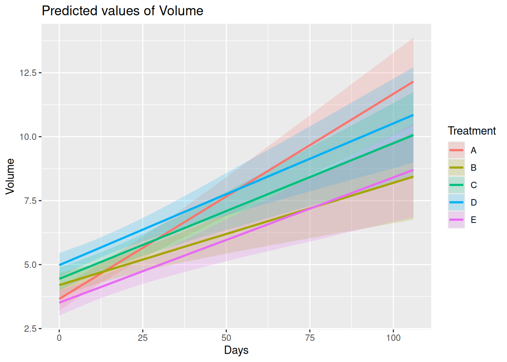
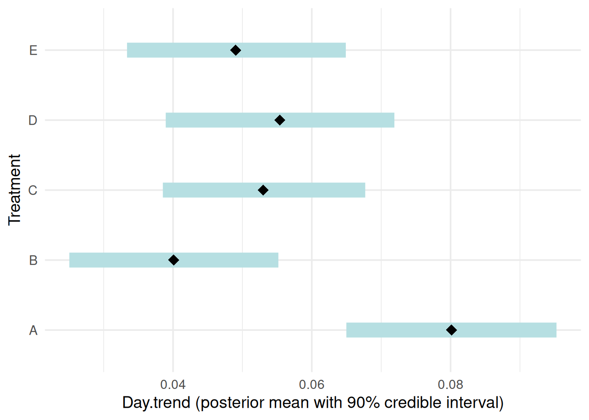
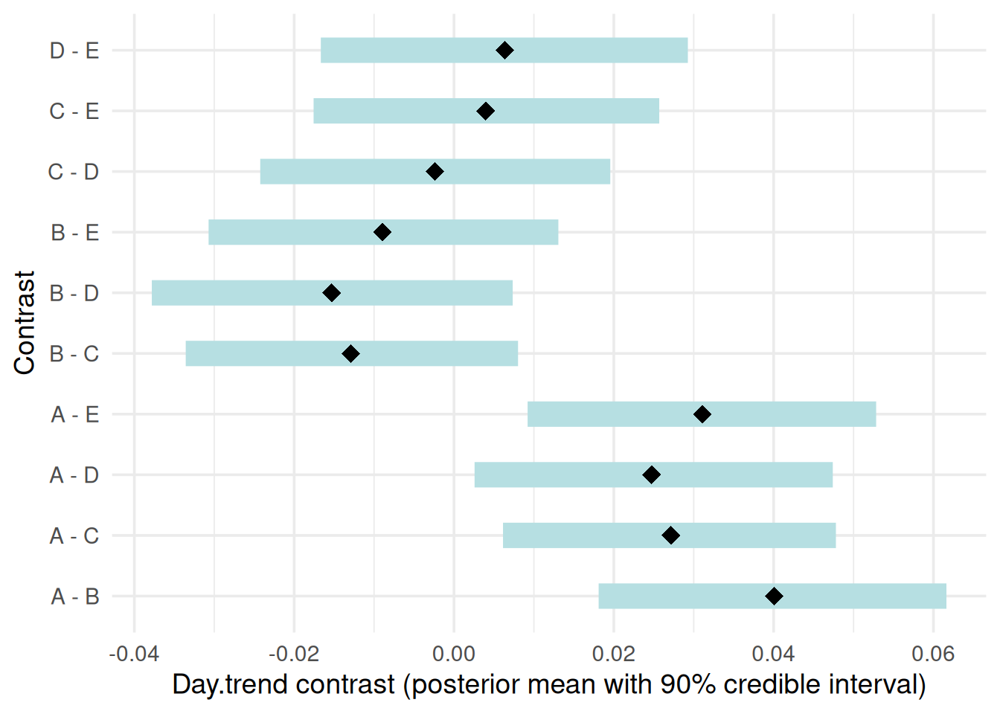
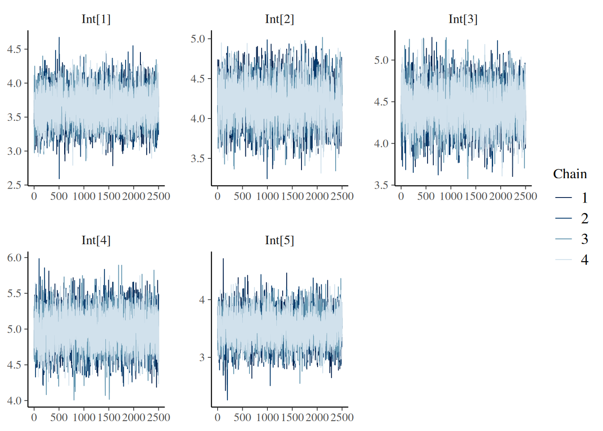
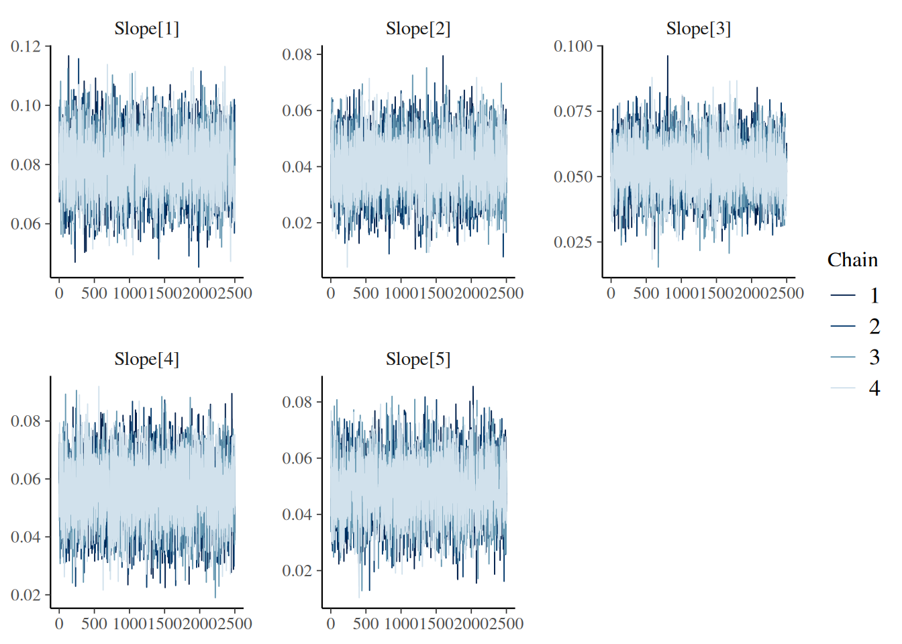
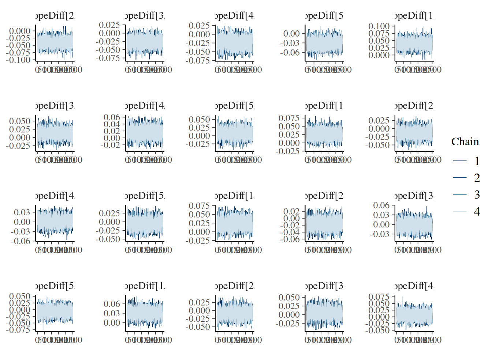

# Bayesian Hierarchical Linear Model

## Environment preparation

Using Bayesian methods requires installing the R package
[`cmdstanr`](https://mc-stan.org/cmdstanr/) (not available on CRAN) and
the command-line interface to Stan:
[`CmdStan`](https://mc-stan.org/users/interfaces/cmdstan.html). Users
may follow the instructions in [Getting started with
CmdStanR](https://mc-stan.org/cmdstanr/articles/cmdstanr.html) to
install both.

## Model setting and notation

Let g = 1,\ldots,K index treatment groups and i =
1,\ldots,N\_{\text{subj}} index subjects.  
Subject i belongs to treatment group g_i \in \\1,\ldots,K\\.  
Let V\_{in} \> 0 denote the observed tumor volume for subject i at time
t\_{in}, and define the log-volume

y\_{in} = \log(V\_{in}).

### Model (log-volume scale)

#### Observation model (Level 1)

For each subject i and measurement n,

y\_{in} \mid \alpha_i, \beta_i, \sigma \sim \mathcal{N}\left(\alpha_i +
\beta_i t\_{in}, \sigma^2\right),

where \alpha_i is the subject-specific intercept (baseline log-volume at
t=0),  
\beta_i is the subject-specific slope (log-scale growth rate),  
and \sigma\>0 is the residual standard deviation.

#### Subject-level random effects (Level 2)

Define the subject-specific parameter vector

\theta_i = \begin{pmatrix} \alpha_i \\ \beta_i \end{pmatrix}, \qquad
\mu_g = \begin{pmatrix} \alpha_g \\ \beta_g \end{pmatrix}.

Conditional on the treatment group g_i,

\theta_i \mid g_i, \mu\_{g_i}, \Sigma \sim \mathcal{N}\_2(\mu\_{g_i},
\Sigma).

We parameterize the random-effects covariance matrix as

\Sigma = D R D, \qquad D = \mathrm{diag}(\tau\_\alpha,\tau\_\beta),
\qquad R = \begin{pmatrix} 1 & \rho \\ \rho & 1 \end{pmatrix},

where \tau\_\alpha\>0 and \tau\_\beta\>0 are the standard deviations of
the random intercept and random slope, and \rho \in (-1,1) is their
correlation.

#### Priors (Level 3)

For g=1,\ldots,K,

\alpha_g \sim \mathcal{N}(0,10^2), \qquad \beta_g \sim
\mathcal{N}(0,10^2).

Residual standard deviation:

\sigma \sim \text{Half-}\mathcal{N}(0,5^2).

Random-effects standard deviations:

\tau\_\alpha \sim \text{Half-}\mathcal{N}(0,5^2), \qquad \tau\_\beta
\sim \text{Half-}\mathcal{N}(0,5^2).

Correlation matrix prior:

R \sim \mathrm{LKJ}(2).

#### Summary

\begin{aligned} y\_{in} \mid \alpha_i,\beta_i,\sigma &\sim
\mathcal{N}(\alpha_i+\beta_i t\_{in},\sigma^2),\\ \theta_i \mid g_i
&\sim \mathcal{N}\_2(\mu\_{g_i}, \Sigma),\\ \alpha_g &\sim
\mathcal{N}(0,10^2), \quad \beta_g \sim \mathcal{N}(0,10^2),\\ \sigma
&\sim \text{Half-}\mathcal{N}(0,5^2),\\ \tau\_\alpha,\tau\_\beta &\sim
\text{Half-}\mathcal{N}(0,5^2), \quad R \sim \mathrm{LKJ}(2).
\end{aligned}

## Example

### Model fit

We begin by loading the example dataset and fitting the Bayesian
hierarchical linear model using
[`bhm()`](https://pbreheny.github.io/tumr/reference/bhm.md). By default,
the model is estimated on the log scale.

``` r

data("melanoma2")
mel2 <- tumr(melanoma2, ID, Day, Volume, Treatment)
fit <- bhm(mel2)
```

### Summary of the results

Posterior summaries can be obtained using the
[`summary()`](https://rdrr.io/r/base/summary.html) method. The output
reports posterior means and corresponding credible intervals for all
estimated quantities, including:

- Treatment-specific intercepts

- Treatment-specific slopes

- Pairwise treatment contrasts in slopes

``` r

summary(fit)
```

    $int_each
    # A tibble: 5 × 7
      treatment  mean    q5   q95 exp_mean exp_q5 exp_q95
      <chr>     <dbl> <dbl> <dbl>    <dbl>  <dbl>   <dbl>
    1 A          3.66  3.28  4.04     38.8   26.5    57.1
    2 B          4.20  3.80  4.59     66.5   44.8    98.4
    3 C          4.44  4.07  4.82     85.0   58.5   123.
    4 D          4.98  4.59  5.38    146.    98.2   217.
    5 E          3.51  3.09  3.91     33.5   22.1    50.1

    $slope_each
    # A tibble: 5 × 10
      treatment   mean     q5    q95 growth_factor_mean growth_factor_q5
      <chr>      <dbl>  <dbl>  <dbl>              <dbl>            <dbl>
    1 A         0.0801 0.0650 0.0953               1.08             1.07
    2 B         0.0401 0.0251 0.0552               1.04             1.03
    3 C         0.0530 0.0385 0.0677               1.05             1.04
    4 D         0.0554 0.0389 0.0719               1.06             1.04
    5 E         0.0490 0.0334 0.0649               1.05             1.03
    # ℹ 4 more variables: growth_factor_q95 <dbl>, pct_change_mean <dbl>,
    #   pct_change_q5 <dbl>, pct_change_q95 <dbl>

    $slope_diff
    # A tibble: 10 × 10
       contrast     mean       q5     q95 ratio_mean ratio_q5 ratio_q95
       <chr>       <dbl>    <dbl>   <dbl>      <dbl>    <dbl>     <dbl>
     1 A - B     0.0400   0.0181  0.0616       1.04     1.02       1.06
     2 A - C     0.0271   0.00613 0.0478       1.03     1.01       1.05
     3 A - D     0.0247   0.00258 0.0474       1.03     1.00       1.05
     4 A - E     0.0311   0.00921 0.0528       1.03     1.01       1.05
     5 B - C    -0.0129  -0.0336  0.00802      0.987    0.967      1.01
     6 B - D    -0.0153  -0.0378  0.00735      0.985    0.963      1.01
     7 B - E    -0.00896 -0.0307  0.0131       0.991    0.970      1.01
     8 C - D    -0.00239 -0.0242  0.0196       0.998    0.976      1.02
     9 C - E     0.00395 -0.0176  0.0257       1.00     0.983      1.03
    10 D - E     0.00634 -0.0167  0.0293       1.01     0.983      1.03
    # ℹ 3 more variables: pct_diff_mean <dbl>, pct_diff_q5 <dbl>,
    #   pct_diff_q95 <dbl>

### Plots

Posterior results can be visualized using the
[`plot()`](https://rdrr.io/r/graphics/plot.default.html) method with
different `type` options. The available plot types include:

- “predict”: Posterior predicted treatment-specific mean trajectories

- “slope”: Posterior summaries of treatment-specific slopes with 90%
  credible intervals

- “contrast”: Pairwise contrasts in slopes between treatment groups with
  90% credible intervals

- “trace”: MCMC trace plots for model diagnostics

``` r

plot(fit, type = "predict")
```



``` r

plot(fit, type = "slope")
```



``` r

plot(fit, type = "contrast")
```



``` r

plot(fit, type = "contrast") +
  ggplot2::scale_x_continuous(
    labels = function(z) scales::number(exp(z), 0.01)
  )
```


``` r

plot(fit, type = "trace")
```

    $trace_intercept




    $trace_slope




    $trace_slope_diff


