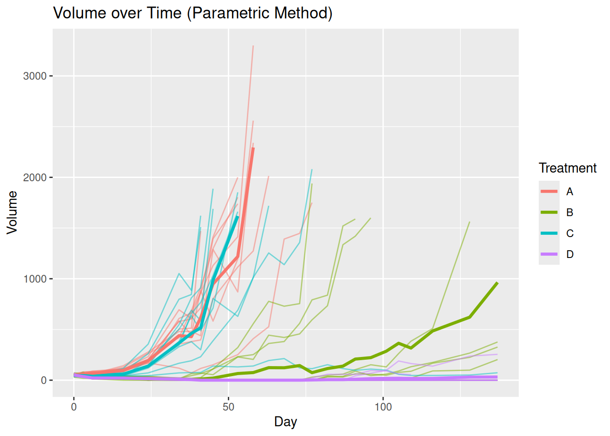
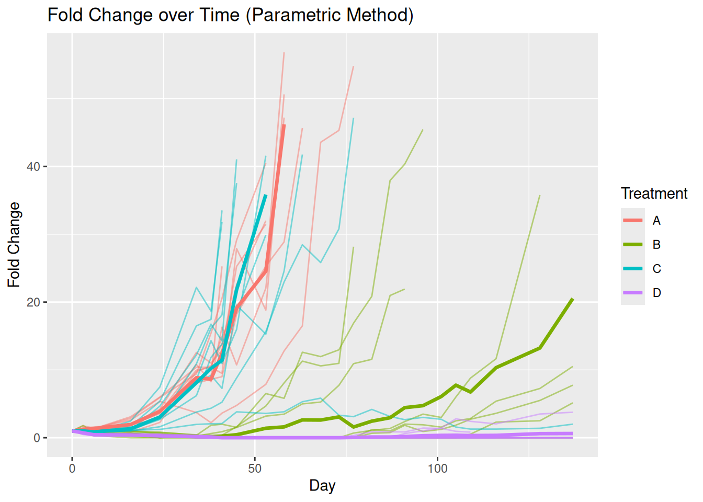
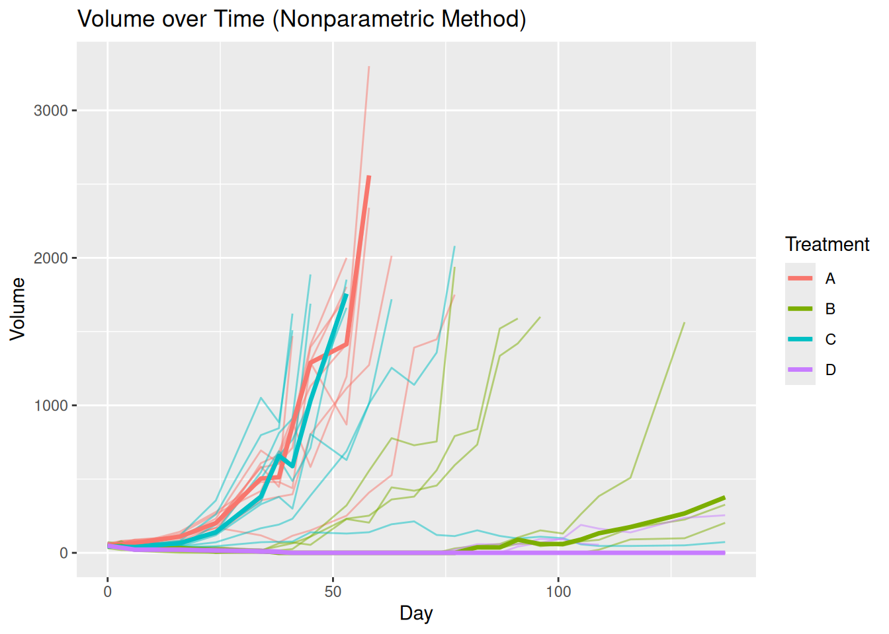
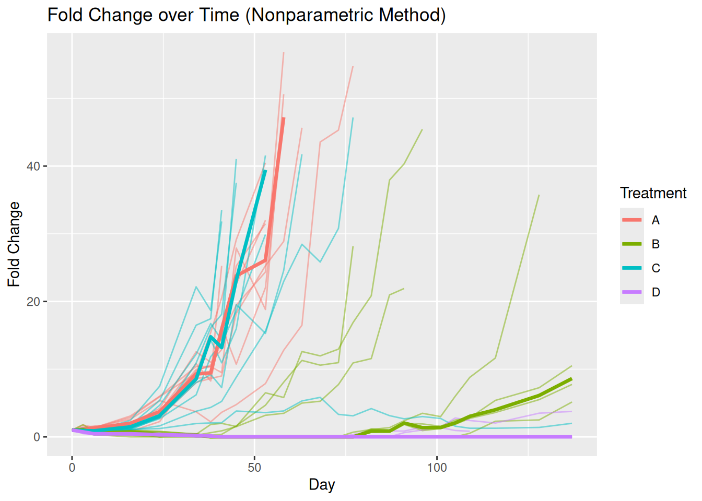
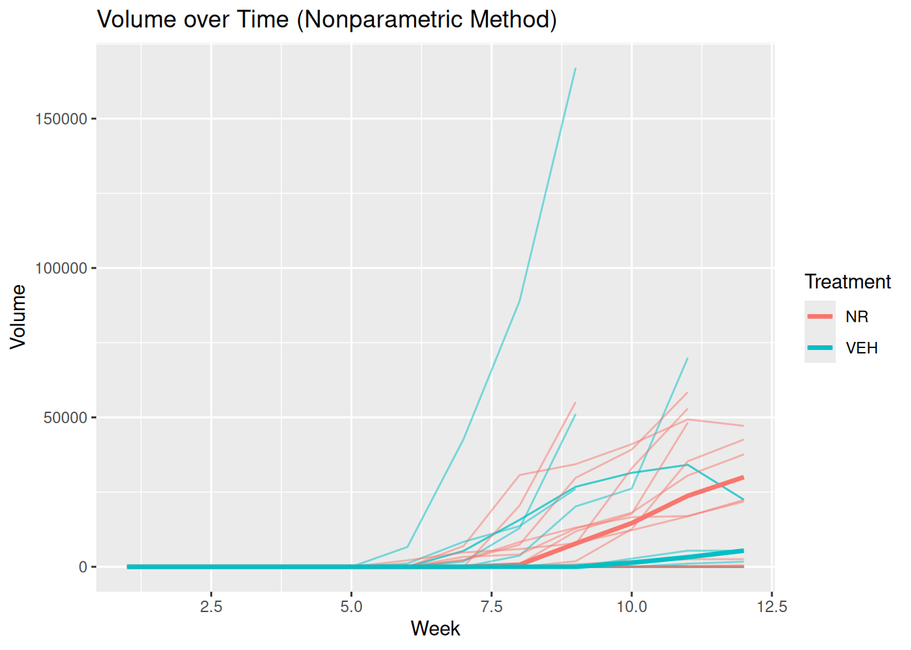
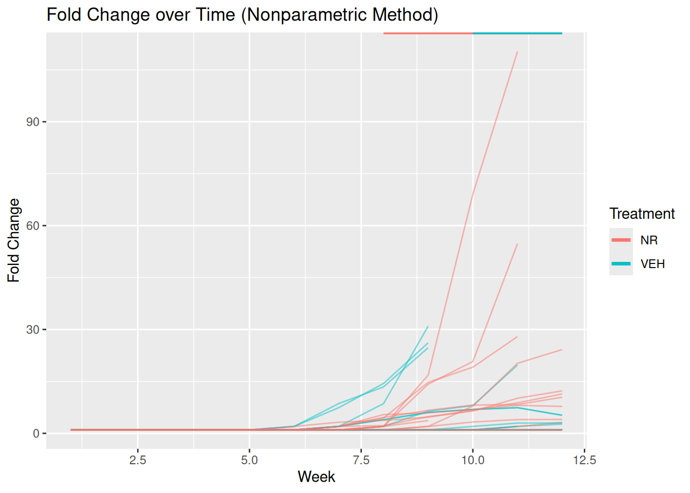
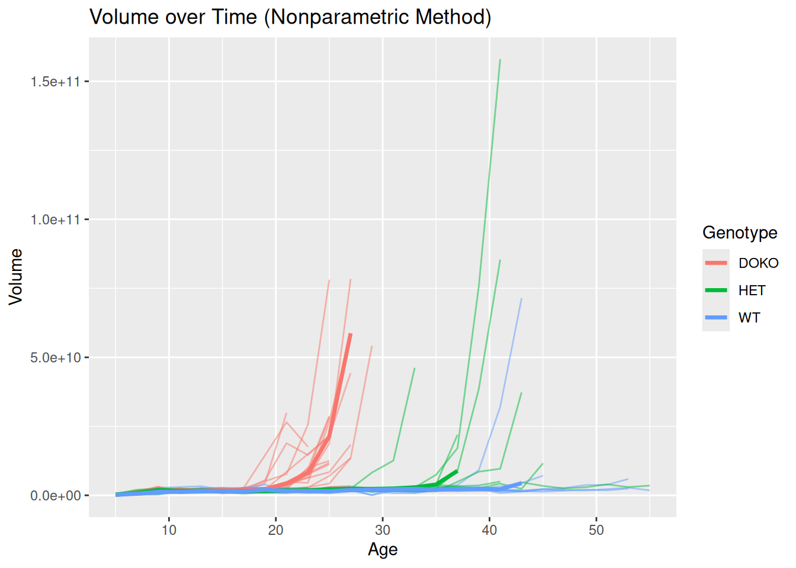
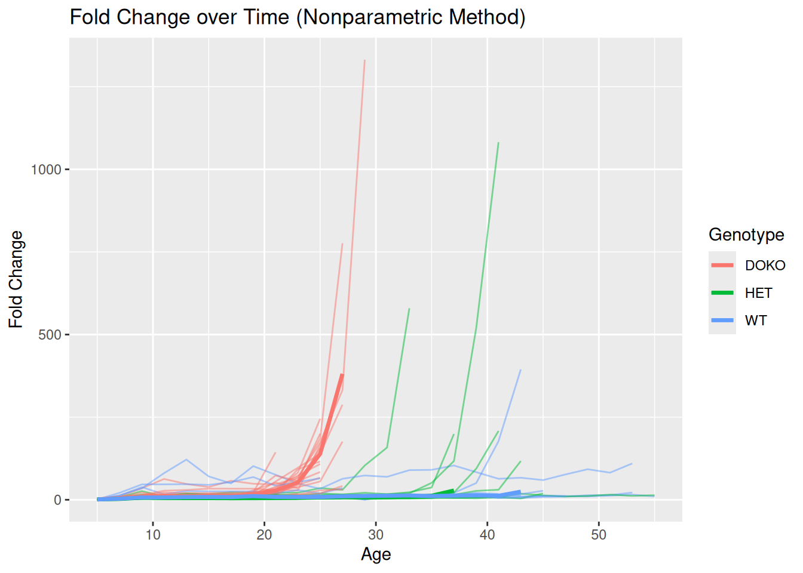

# tumr data sets

## Introduction

Each dataset is presented with four plots: the raw values and
corresponding fold-change results from the parametric method, as well as
the raw values and fold-change results from the nonparametric method.

## Another Melanoma Data Set, *melanoma1*

## Breast Cancer Data Set, *breast*

## Prostate Cancer Data Set, *prostate*

