# tumr data sets

## Introduction

Each dataset is presented with four plots: the raw values and
corresponding fold-change results from the parametric method, as well as
the raw values and fold-change results from the nonparametric method.

## Another Melanoma Data Set, *melanoma1*

    Warning:
    --------------------------------------------------------------------
    The time range is greater than 50, which may cause convergence
    issues when fitting lmm(). Consider rescaling the time variable
    to a larger unit (e.g., from days to weeks or months).
    --------------------------------------------------------------------

``` r

plot(mel1, par = TRUE, fold = FALSE)
plot(mel1, par = TRUE, fold = TRUE)
```

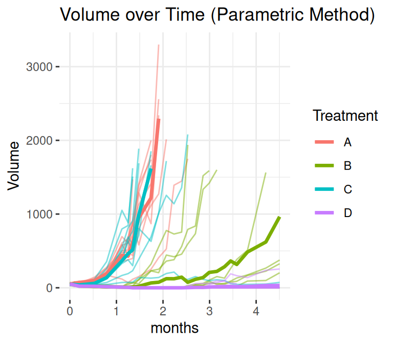

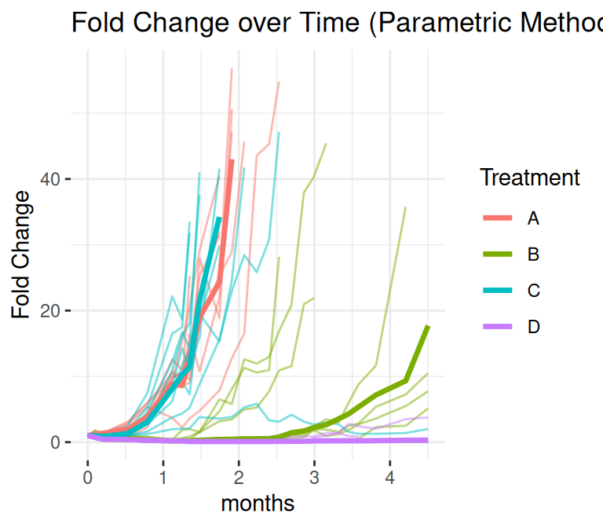

``` r

plot(mel1, par = FALSE, fold = FALSE)
plot(mel1, par = FALSE, fold = TRUE)
```

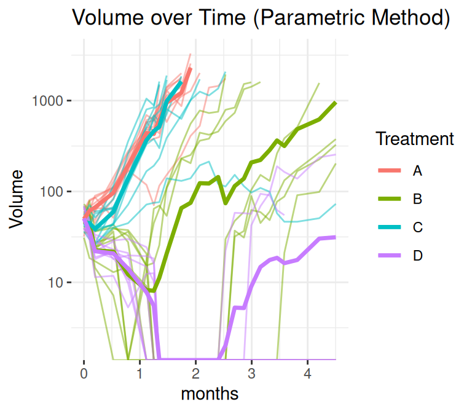

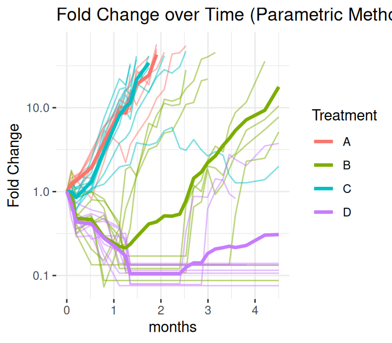

## Breast Cancer Data Set, *breast*

``` r

plot(breast_meta, par = TRUE, fold = FALSE)
plot(breast_meta, par = TRUE, fold = TRUE)
```

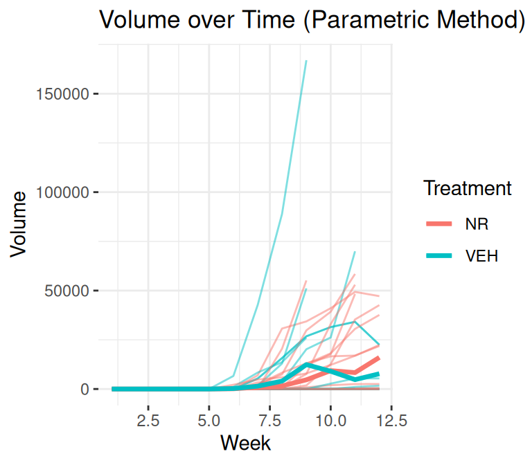

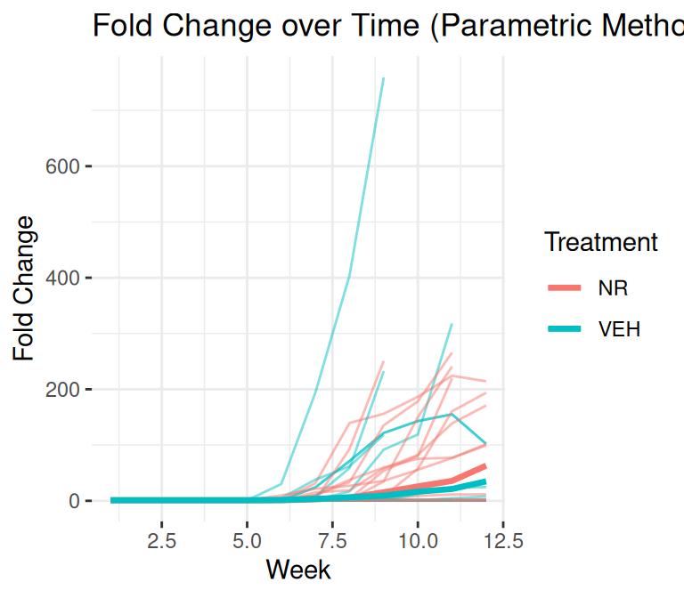

``` r

plot(breast_meta, par = FALSE, fold = FALSE)
plot(breast_meta, par = FALSE, fold = TRUE)
```

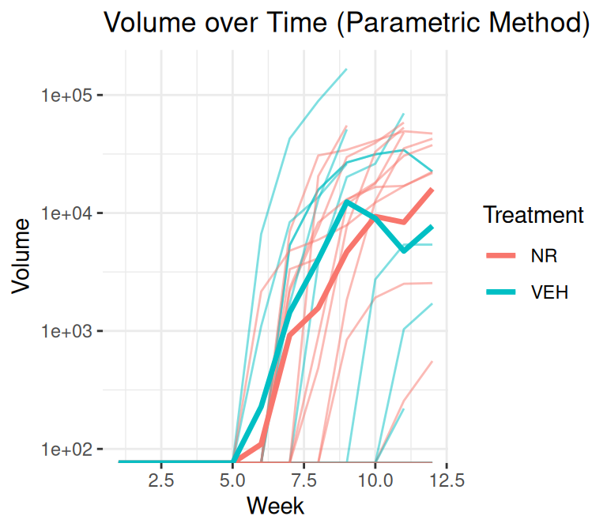

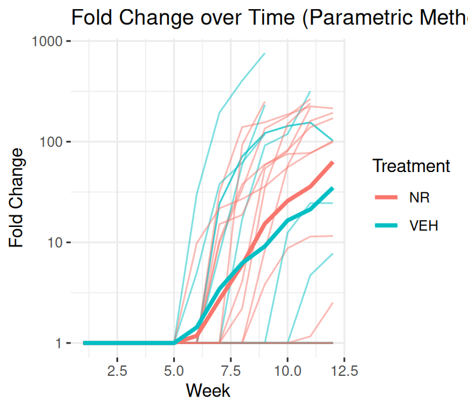

## Prostate Cancer Data Set, *prostate*

``` r

plot(pros_meta, par = TRUE, fold = FALSE)
plot(pros_meta, par = TRUE, fold = TRUE)
```

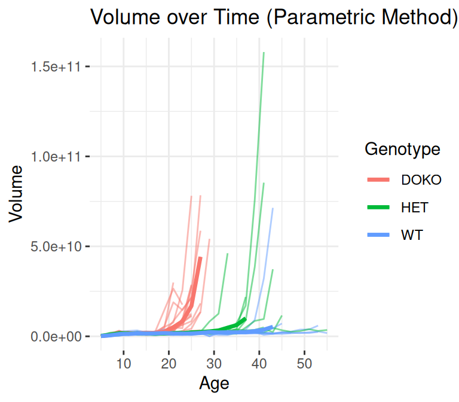

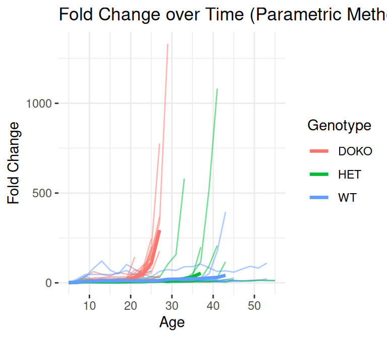

``` r

plot(pros_meta, par = FALSE, fold = FALSE)
plot(pros_meta, par = FALSE, fold = TRUE)
```

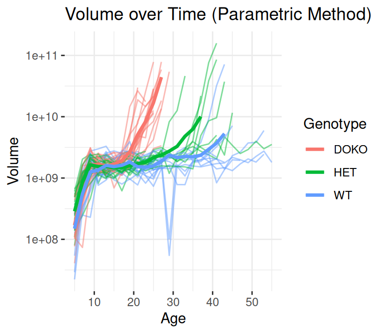

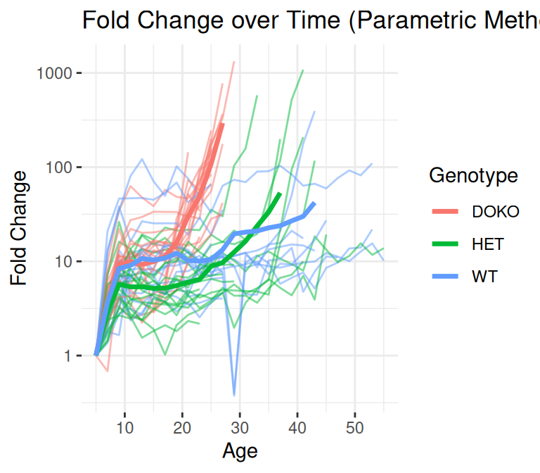
