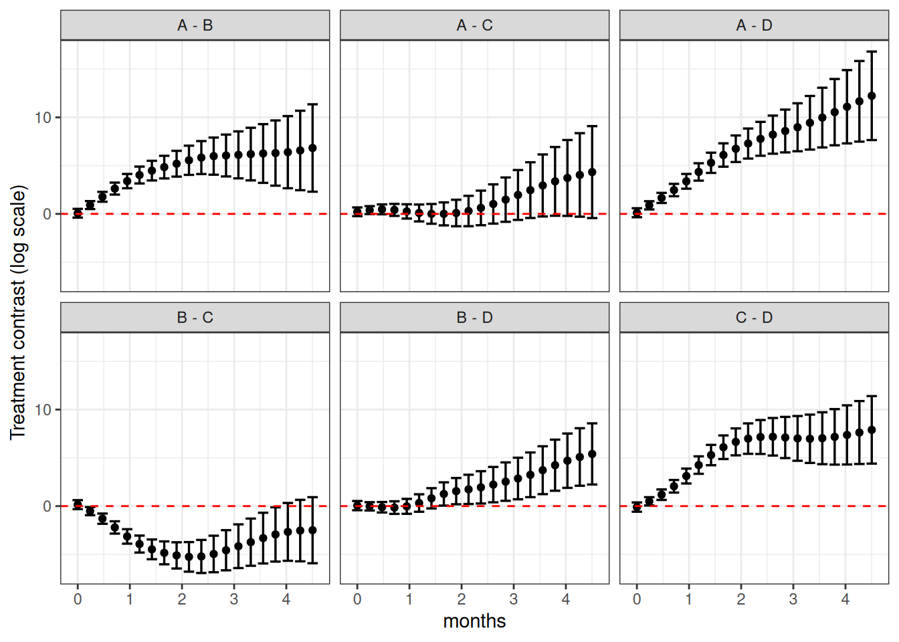

# Nonlinear - Generalized Addictive Model (GAM)

The package also includes `gam()`, which fits a generalized additive
mixed effects model to tumor growth data. This model is useful when
tumor growth over time follows a complex nonlinear trajectory that
cannot be captured by polynomial terms.

By default, `gam()` fits the model:

\log(\text{measure}) \sim \text{group} + s(\text{time},\\ \text{by} =
\text{group}) + (\text{time} \mid \text{id}) where s(\cdot) is a
group-specific smooth term for time.

## Model fit

``` r

melanoma1$months <- melanoma1$Day / (365/12)
mel1 <- tumr(melanoma1, ID, months, Volume, Treatment)
fit <- tumr_gam(mel1)
```

## Result summary

``` r

summary(fit)
```

     contrast    estimate        SE p.value
        A - B  4.94021481 0.6216152  0.0000
        A - C  0.01675351 0.6329712  0.9789
        A - D  6.29711932 0.6400391  0.0000
        B - C -4.92346130 0.6302455  0.0000
        B - D  1.35690452 0.6373436  0.0674
        C - D  6.28036581 0.6484241  0.0000

## Plot

``` r

plot(mel1) 
```


``` r

plot(mel1) + ggplot2::scale_y_log10()
```

    Warning in ggplot2::scale_y_log10(): log-10 transformation introduced infinite values.
    log-10 transformation introduced infinite values.


``` r

plot(fit, "predict")
```

    Model has log transformed response. Predictions are on transformed
      scale.


``` r

plot(fit, "contrast")
```


