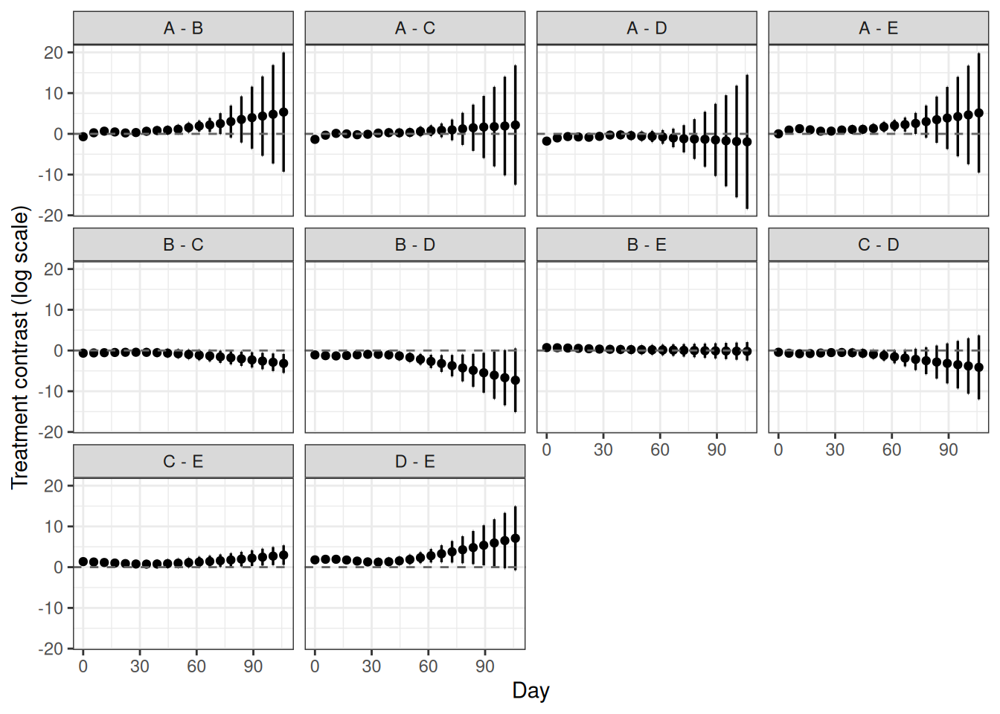

# Generalized Addictive Mixed Model

The package also includes `gam()`, which fits a generalized additive
mixed effects model to tumor growth data. This model is useful when
tumor growth over time follows a complex nonlinear trajectory that
cannot be captured by polynomial terms.

By default, `gam()` fits the model:

\log(1 + \text{measure}) \sim \text{group} + s(\text{time},\\ \text{by}
= \text{group}) + (\text{time} \mid \text{id}) where s(\cdot) is a
group-specific smooth term for time.

## Model fit

``` r

mel2 <- tumr(melanoma2, ID, Day, Volume, Treatment)
fit <- gamFit(mel2)
```

## Result summary

``` r

summary(fit)
```

     contrast   estimate        SE p.value
        A - B  0.5994256 0.4189060  0.9186
        A - C  0.1515592 0.4056295  1.0000
        A - D -0.3359103 0.4160643  1.0000
        A - E  0.8976805 0.4325896  0.3081
        B - C -0.4478664 0.4127334  1.0000
        B - D -0.9353359 0.4229930  0.2474
        B - E  0.2982549 0.4392577  1.0000
        C - D -0.4874695 0.4098490  1.0000
        C - E  0.7461213 0.4266151  0.5666
        D - E  1.2335907 0.4365485  0.0491

## Plot

``` r

plot_median(mel2) 
```


``` r

plot(fit, "predict") + ggplot2::scale_y_log10()
```


``` r

plot(fit, "contrast")
```


