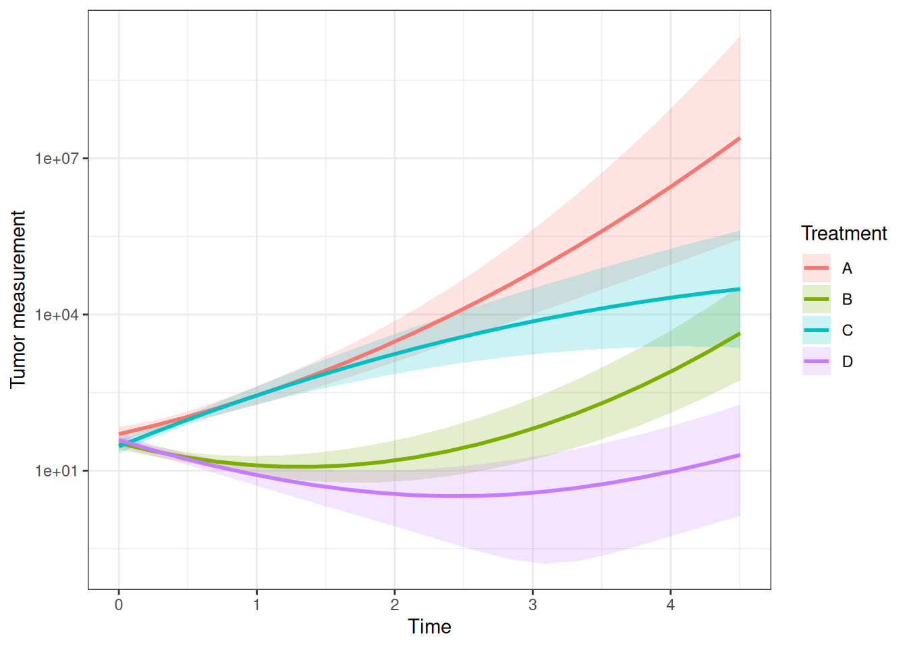
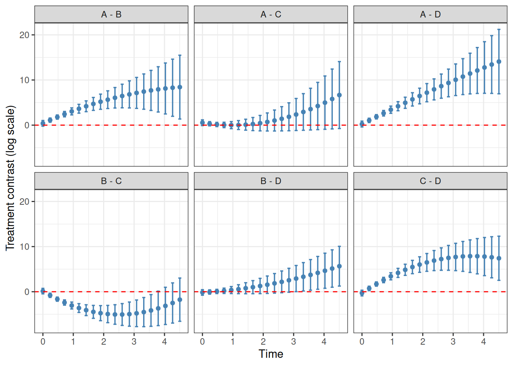

# Exponential quadratic Model

The package also includes
[`quad()`](https://pbreheny.github.io/tumr/reference/quad.md), which
fits a Exponential quadratic linear mixed effects model to tumor growth
data. This model is useful when tumor growth over time may be nonlinear
rather than strictly linear.

Exponential quadratic linear mixed models are well suited for
longitudinal tumor growth data because they account for:

- Fixed effects: population-level effects of interest, such as
  treatment, time, and the quadratic effect of time
- Random effects: subject-specific variability that induces correlation
  among repeated measurements

By default,
[`quad()`](https://pbreheny.github.io/tumr/reference/quad.md) fits the
model:

\log(\text{measure}) \sim (\text{time} + \text{time}^2) \*
\text{group} + (\text{time} \mid \text{id})

## Model fit

``` r

melanoma1$months <- melanoma1$Day / (365/12)
mel1 <- tumr(melanoma1, ID, months, Volume, Treatment)
fit_quad <- quad(mel1)
```

## Summary

``` r

summary(fit_quad)
```

    NOTE: Results may be misleading due to involvement in interactions

     contrast   estimate        SE p.value
        A - B  4.8419694 0.5525961  0.0000
        A - C  0.2878099 0.5630237  0.6125
        A - D  5.9225040 0.5688272  0.0000
        B - C -4.5541595 0.5531198  0.0000
        B - D  1.0805346 0.5590261  0.1259
        C - D  5.6346941 0.5693359  0.0000

## Plot

``` r

plot(mel1) 
```


``` r

plot(mel1) + ggplot2::scale_y_log10()
```

    Warning in ggplot2::scale_y_log10(): log-10 transformation introduced infinite values.
    log-10 transformation introduced infinite values.


``` r

plot(fit_quad, "predict") 
```



``` r

plot(fit_quad, "contrast")
```


