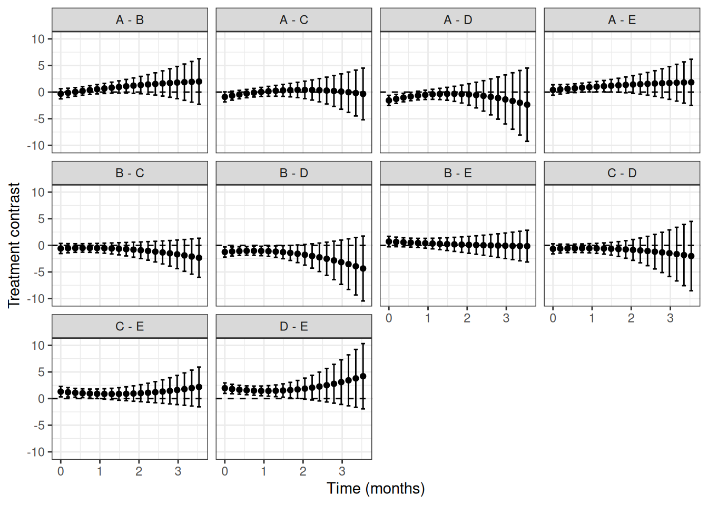

# Quadratic Linear Mixed Model

The package also includes
[`quad()`](https://pbreheny.github.io/tumr/reference/quad.md), which
fits a quadratic linear mixed effects model to tumor growth data. This
model is useful when tumor growth over time may be nonlinear rather than
strictly linear.

Quadratic linear mixed models are well suited for longitudinal tumor
growth data because they account for:

- Fixed effects: population-level effects of interest, such as
  treatment, time, and the quadratic effect of time
- Random effects: subject-specific variability that induces correlation
  among repeated measurements

By default,
[`quad()`](https://pbreheny.github.io/tumr/reference/quad.md) fits the
model:

\log(1 + \text{measure}) \sim (\text{time} + \text{time}^2) \*
\text{group} + (\text{time} \mid \text{id})

## Model fit

``` r

mel2 <- tumr(melanoma2, ID, Day, Volume, Treatment)
quad_obj <- quad(mel2)
```

## Plot

``` r

plot(quad_obj)
```


