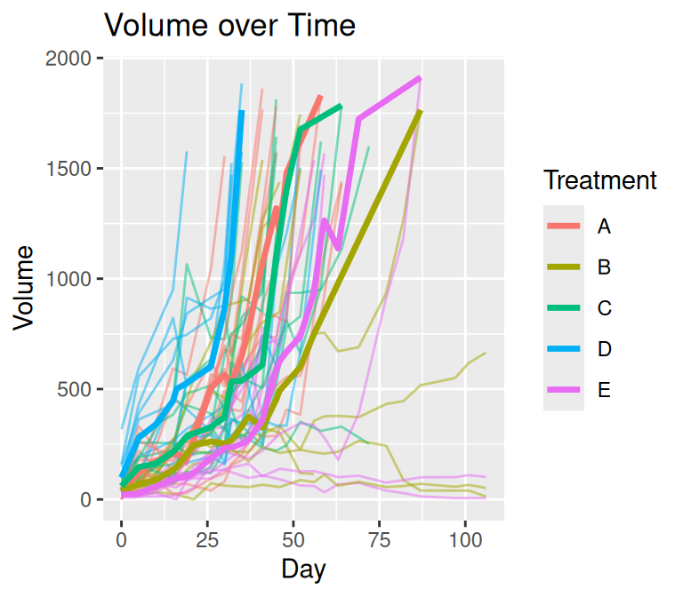
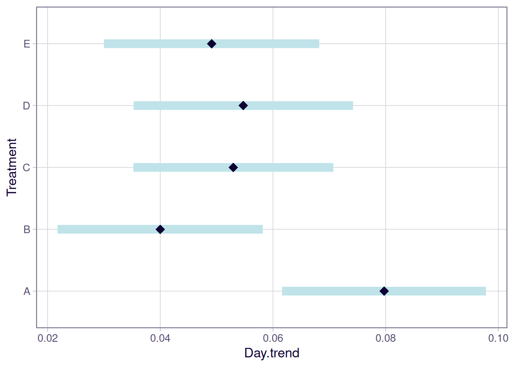
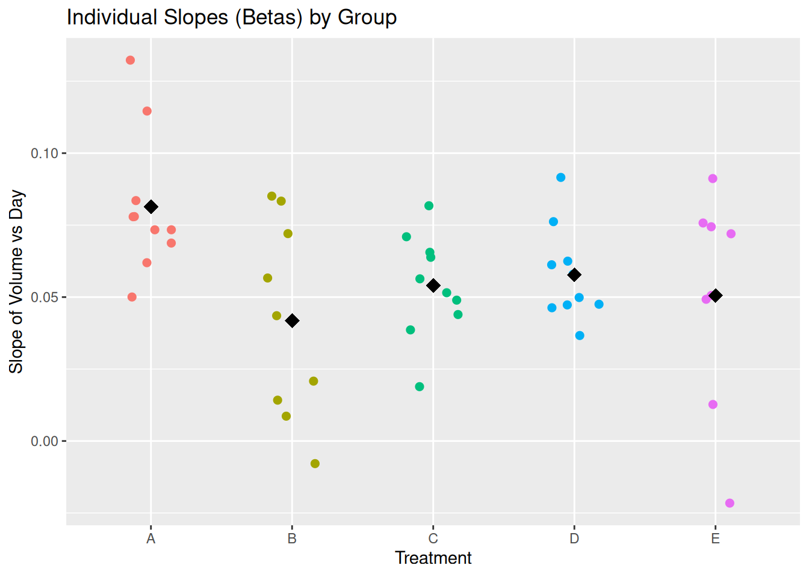
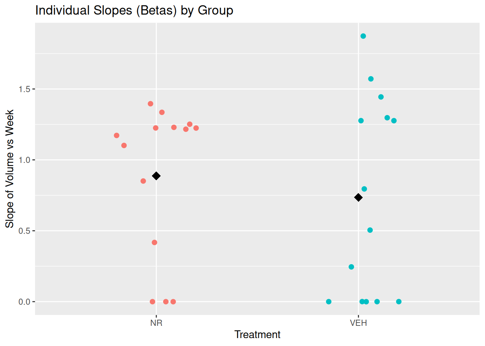
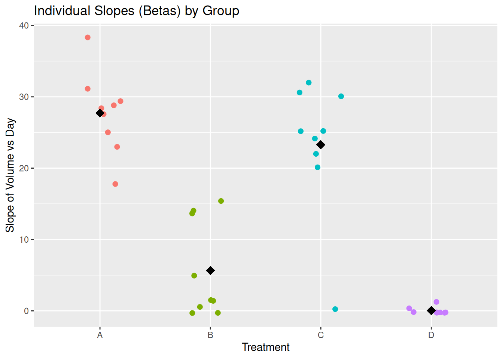
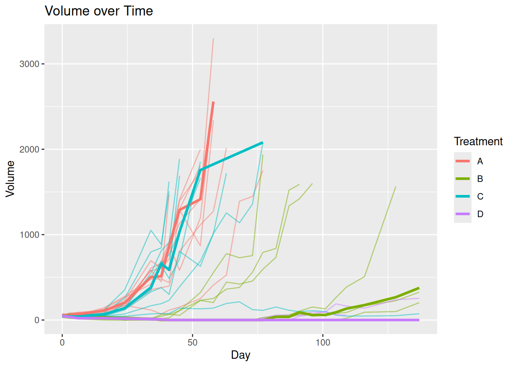
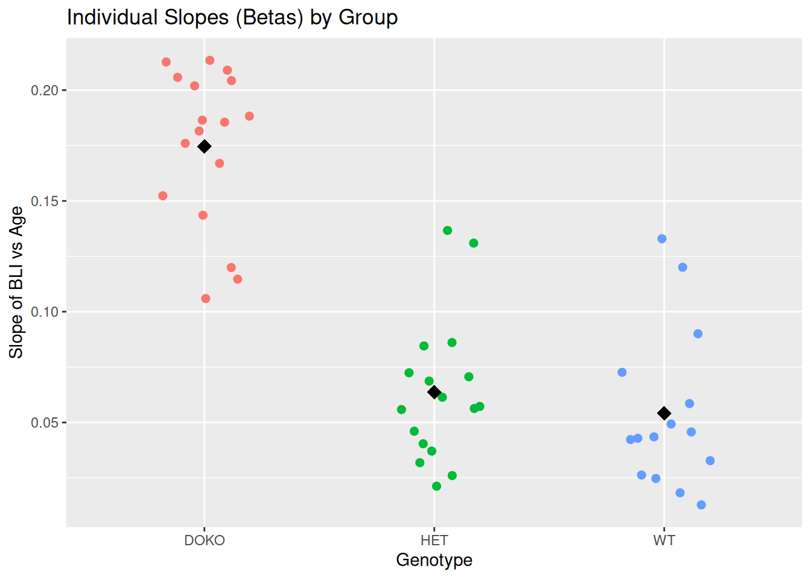

# Getting started with the tumr package

## Melanoma

``` r
library(tumr)
data("melanoma2")
```

##### Code for plot_mean()

Code

``` r
plot_mean <- function(data, group, time, measure, id, stat = median, remove_na = FALSE){
  data_summary <- data |>
    dplyr::group_by({{group}}, {{time}}) |>
    dplyr::summarise(measure = stat({{measure}}, na.rm = remove_na), .groups = "drop_last") |>
    dplyr::ungroup()

  if (remove_na == TRUE) {
    data_full <- data |>
      na.omit(data)
  } else {
    data_full <- data
  }

  ggplot2::ggplot() +
    ggplot2::geom_line(data = data_full,
                       ggplot2::aes(x = {{time}},
                                    y = {{measure}},
                                    group = {{id}},
                                    color = {{group}}),
                       alpha = 0.5)  +
    ggplot2::geom_line(data = data_summary,
                       ggplot2::aes(x = {{time}},
                                    y = measure,
                                    color = {{group}}),
                       linewidth = 1.2) +
    ggplot2::labs(
            y = "Volume",
            title = "Volume over Time"
          )

}
```

### Plotting the Mean vs the Median

``` r
mel2 <- tumr(melanoma2, ID, Day, Volume, Treatment)
plot_mean(melanoma2, Treatment, Day, Volume, ID, stat = mean)
plot_median(mel2)
```




### Response feature analysis

``` r
(rfeat_mel2 <- rfeat(mel2, comparison = "both"))
```

    $anova
                Df Sum Sq Mean Sq F value Pr(>F)
    Group        4   1803   450.7   3.408 0.0168 *
    Residuals   42   5554   132.2
    ---
    Signif. codes:  0 '***' 0.001 '**' 0.01 '*' 0.05 '.' 0.1 ' ' 1

    $tukey
      Tukey multiple comparisons of means
        95% family-wise confidence level

    Fit: aov(formula = Beta ~ Group, data = betas)

    $Group
               diff         lwr        upr     p adj
    B-A -12.9067597 -27.9647734  2.1512540 0.1239895
    C-A  -5.8980893 -20.5544836  8.7583050 0.7807978
    D-A   1.4573384 -13.1990559 16.1137327 0.9985310
    E-A -13.5892260 -29.1346797  1.9562277 0.1120331
    C-B   7.0086704  -8.0493433 22.0666841 0.6765864
    D-B  14.3640981  -0.6939156 29.4221119 0.0679418
    E-B  -0.6824663 -16.6071331 15.2422006 0.9999476
    D-C   7.3554277  -7.3009666 22.0118221 0.6121467
    E-C  -7.6911367 -23.2365904  7.8543170 0.6248441
    E-D -15.0465644 -30.5920181  0.4988893 0.0619834

``` r
plot(rfeat_mel2)
```


### Linear mixed model

``` r
lmm_mel2 <- lmm(mel2)
```

    Warning in checkConv(attr(opt, "derivs"), opt$par, ctrl = control$checkConv, :
    Model failed to converge with max|grad| = 0.00566844 (tol = 0.002, component 1)

``` r
summary(lmm_mel2)
```

    $`overall effect of time`
     1       Day.trend      SE   df lower.CL upper.CL
     overall    0.0553 0.00411 41.3    0.047   0.0636

    Results are averaged over the levels of: Treatment
    Degrees-of-freedom method: kenward-roger
    Confidence level used: 0.95

    $`slope of treatment over time`
     Treatment Day.trend      SE   df lower.CL upper.CL
     A            0.0797 0.00898 43.6   0.0616   0.0978
     B            0.0400 0.00898 35.8   0.0218   0.0582
     C            0.0530 0.00879 40.6   0.0352   0.0707
     D            0.0547 0.00972 55.4   0.0353   0.0742
     E            0.0491 0.00941 34.4   0.0300   0.0682

    Degrees-of-freedom method: kenward-roger
    Confidence level used: 0.95

    $`test slope differences`
     contrast estimate     SE   df t.ratio p.value
     A - B     0.03972 0.0127 39.4   3.128  0.0258
     A - C     0.02673 0.0126 42.1   2.128  0.2277
     A - D     0.02497 0.0132 49.4   1.887  0.3378
     A - E     0.03060 0.0130 38.4   2.354  0.1505
     B - C    -0.01300 0.0126 38.0  -1.034  0.8378
     B - D    -0.01476 0.0132 44.8  -1.115  0.7977
     B - E    -0.00912 0.0130 35.0  -0.701  0.9548
     C - D    -0.00176 0.0131 47.9  -0.134  0.9999
     C - E     0.00388 0.0129 37.0   0.301  0.9981
     D - E     0.00564 0.0135 43.4   0.417  0.9934

    Degrees-of-freedom method: kenward-roger
    P value adjustment: tukey method for comparing a family of 5 estimates 

### Plot of linear mixed model

``` r
plot(lmm_mel2)
```

    Model has log1p-transformed response. Back-transforming predictions to
      original response scale. Standard errors are still on the transformed
      scale.

    $predicted_measure


    $mean_betas



## Other data sets

### Breast cancer

``` r
breast_meta <- tumr(breast, ID, Week, Volume, Treatment)

plot_median(breast_meta)
```



``` r
breast_rfeat <- rfeat(breast_meta, comparison = "t.test")
plot(breast_rfeat)
```



``` r
breast_lmm <- lmm(breast_meta)
```

    boundary (singular) fit: see help('isSingular')

``` r
summary(breast_lmm)
```

    $`overall effect of time`
     1       Week.trend   SE df lower.CL upper.CL
     overall      0.802 0.12 26    0.557     1.05

    Results are averaged over the levels of: Treatment
    Degrees-of-freedom method: kenward-roger
    Confidence level used: 0.95

    $`slope of treatment over time`
     Treatment Week.trend    SE   df lower.CL upper.CL
     NR             0.882 0.169 25.7    0.535     1.23
     VEH            0.723 0.170 26.2    0.374     1.07

    Degrees-of-freedom method: kenward-roger
    Confidence level used: 0.95

    $`test slope differences`
     contrast estimate    SE df t.ratio p.value
     NR - VEH     0.16 0.239 26   0.667  0.5106

    Degrees-of-freedom method: kenward-roger 

### Another melanoma

``` r
mel1 <- tumr(melanoma1, ID, Day, Volume, Treatment)

plot_median(mel1)
```


``` r
(mel1_rfeat <- rfeat(mel1, comparison = "both"))
```

    $anova
                Df Sum Sq Mean Sq F value   Pr(>F)
    Group        3   4645  1548.3   35.62 3.64e-10 ***
    Residuals   31   1347    43.5
    ---
    Signif. codes:  0 '***' 0.001 '**' 0.01 '*' 0.05 '.' 0.1 ' ' 1

    $tukey
      Tukey multiple comparisons of means
        95% family-wise confidence level

    Fit: aov(formula = Beta ~ Group, data = betas)

    $Group
              diff        lwr        upr     p adj
    B-A -22.058493 -30.493598 -13.623388 0.0000003
    C-A  -4.427555 -12.862660   4.007550 0.4940635
    D-A -27.682834 -36.377542 -18.988126 0.0000000
    C-B  17.630938   9.195833  26.066043 0.0000179
    D-B  -5.624341 -14.319048   3.070367 0.3134169
    D-C -23.255279 -31.949987 -14.560571 0.0000002

``` r
plot(mel1_rfeat)
```



``` r
(mel1_lmm <- lmm(mel1))
```

    Warning in checkConv(attr(opt, "derivs"), opt$par, ctrl = control$checkConv, :
    Model failed to converge with max|grad| = 0.3043 (tol = 0.002, component 1)

    Linear mixed model fit by REML. t-tests use Satterthwaite's method [
    lmerModLmerTest]
    Formula: log1p(Volume) ~ Treatment * Day + (Day | ID)
       Data: data

    REML criterion at convergence: 2057.9

    Scaled residuals:
        Min      1Q  Median      3Q     Max
    -2.7388 -0.4455  0.0897  0.5194  3.2523

    Random effects:
     Groups   Name        Variance  Std.Dev. Corr
     ID       (Intercept) 0.1006944 0.31732
              Day         0.0005492 0.02344  -0.29
     Residual             1.4496878 1.20403
    Number of obs: 600, groups:  ID, 35

    Fixed effects:
                    Estimate Std. Error        df t value Pr(>|t|)
    (Intercept)     3.803278   0.241055 63.696770  15.778  < 2e-16 ***
    TreatmentB     -2.077289   0.311809 44.850653  -6.662 3.29e-08 ***
    TreatmentC     -0.151380   0.336695 58.812300  -0.450  0.65465
    TreatmentD     -1.482092   0.315893 42.320462  -4.692 2.84e-05 ***
    Day             0.064163   0.010131 58.005388   6.333 3.82e-08 ***
    TreatmentB:Day -0.042430   0.013049 41.175964  -3.252  0.00229 **
    TreatmentC:Day -0.003019   0.014348 55.455508  -0.210  0.83412
    TreatmentD:Day -0.081544   0.013289 39.417584  -6.136 3.21e-07 ***
    ---
    Signif. codes:  0 '***' 0.001 '**' 0.01 '*' 0.05 '.' 0.1 ' ' 1

    Correlation of Fixed Effects:
                (Intr) TrtmnB TrtmnC TrtmnD Day    TrtB:D TrtC:D
    TreatmentB  -0.773
    TreatmentC  -0.716  0.553
    TreatmentD  -0.763  0.590  0.546
    Day         -0.567  0.438  0.406  0.432
    TretmntB:Dy  0.440 -0.489 -0.315 -0.336 -0.776
    TretmntC:Dy  0.400 -0.309 -0.559 -0.305 -0.706  0.548
    TretmntD:Dy  0.432 -0.334 -0.309 -0.475 -0.762  0.592  0.538
    optimizer (nloptwrap) convergence code: 0 (OK)
    Model failed to converge with max|grad| = 0.3043 (tol = 0.002, component 1)

``` r
summary(mel1_lmm)
```

    $`overall effect of time`
     1       Day.trend      SE   df lower.CL upper.CL
     overall    0.0324 0.00467 33.8   0.0229   0.0419

    Results are averaged over the levels of: Treatment
    Degrees-of-freedom method: kenward-roger
    Confidence level used: 0.95

    $`slope of treatment over time`
     Treatment Day.trend      SE   df lower.CL upper.CL
     A            0.0642 0.01010 50.2   0.0438 0.084541
     B            0.0217 0.00823 22.8   0.0047 0.038767
     C            0.0611 0.01020 45.6   0.0405 0.081744
     D           -0.0174 0.00860 21.7  -0.0352 0.000469

    Degrees-of-freedom method: kenward-roger
    Confidence level used: 0.95

    $`test slope differences`
     contrast estimate     SE   df t.ratio p.value
     A - B     0.04243 0.0131 35.4   3.248  0.0130
     A - C     0.00302 0.0144 47.8   0.210  0.9967
     A - D     0.08154 0.0133 33.9   6.131  <.0001
     B - C    -0.03941 0.0131 33.7  -3.001  0.0247
     B - D     0.03911 0.0119 22.2   3.286  0.0164
     C - D     0.07852 0.0134 32.4   5.875  <.0001

    Degrees-of-freedom method: kenward-roger
    P value adjustment: tukey method for comparing a family of 4 estimates 

### Prostate cancer

``` r
pros_meta <- tumr(prostate, ID, Age, BLI, Genotype)

plot_median(pros_meta)
```



``` r
(pros_rfeat <- rfeat(pros_meta, comparison = "both"))
```

    $anova
                Df    Sum Sq   Mean Sq F value   Pr(>F)
    Group        2 6.588e+18 3.294e+18   13.71 2.14e-05 ***
    Residuals   46 1.105e+19 2.403e+17
    ---
    Signif. codes:  0 '***' 0.001 '**' 0.01 '*' 0.05 '.' 0.1 ' ' 1

    $tukey
      Tukey multiple comparisons of means
        95% family-wise confidence level

    Fit: aov(formula = Beta ~ Group, data = betas)

    $Group
                   diff         lwr        upr     p adj
    HET-DOKO -656394790 -1063611872 -249177709 0.0008827
    WT-DOKO  -858422884 -1278994877 -437850891 0.0000313
    WT-HET   -202028094  -622600087  218543899 0.4808144

``` r
plot(pros_rfeat)
```



``` r
(pros_lmm <- lmm(pros_meta))
```

    Warning in checkConv(attr(opt, "derivs"), opt$par, ctrl = control$checkConv, :
    Model failed to converge with max|grad| = 0.00478111 (tol = 0.002, component 1)

    Linear mixed model fit by REML. t-tests use Satterthwaite's method [
    lmerModLmerTest]
    Formula: log1p(BLI) ~ Genotype * Age + (Age | ID)
       Data: data

    REML criterion at convergence: 1423.8

    Scaled residuals:
        Min      1Q  Median      3Q     Max
    -5.2046 -0.4834  0.0116  0.5532  3.2088

    Random effects:
     Groups   Name        Variance  Std.Dev. Corr
     ID       (Intercept) 0.1824792 0.42718
              Age         0.0006397 0.02529  -0.91
     Residual             0.4264456 0.65303
    Number of obs: 662, groups:  ID, 49

    Fixed effects:
                     Estimate Std. Error        df t value Pr(>|t|)
    (Intercept)     18.849994   0.159658 73.273902 118.065  < 2e-16 ***
    GenotypeHET      1.161121   0.215336 58.907212   5.392 1.29e-06 ***
    GenotypeWT       1.203959   0.217579 53.964181   5.533 9.45e-07 ***
    Age              0.172293   0.009613 95.312319  17.923  < 2e-16 ***
    GenotypeHET:Age -0.107699   0.012541 63.665873  -8.588 3.10e-12 ***
    GenotypeWT:Age  -0.125381   0.012553 57.175131  -9.988 3.79e-14 ***
    ---
    Signif. codes:  0 '***' 0.001 '**' 0.01 '*' 0.05 '.' 0.1 ' ' 1

    Correlation of Fixed Effects:
                (Intr) GntHET GntyWT Age    GHET:A
    GenotypeHET -0.741
    GenotypeWT  -0.734  0.544
    Age         -0.911  0.675  0.668
    GntypHET:Ag  0.698 -0.903 -0.512 -0.767
    GentypWT:Ag  0.697 -0.517 -0.901 -0.766  0.587
    optimizer (nloptwrap) convergence code: 0 (OK)
    Model failed to converge with max|grad| = 0.00478111 (tol = 0.002, component 1)

``` r
summary(pros_lmm)
```

    $`overall effect of time`
     1       Age.trend    SE   df lower.CL upper.CL
     overall    0.0946 0.005 46.4   0.0845    0.105

    Results are averaged over the levels of: Genotype
    Degrees-of-freedom method: kenward-roger
    Confidence level used: 0.95

    $`slope of treatment over time`
     Genotype Age.trend      SE   df lower.CL upper.CL
     DOKO        0.1723 0.00962 86.8   0.1532   0.1914
     HET         0.0646 0.00812 36.0   0.0481   0.0811
     WT          0.0469 0.00814 29.3   0.0303   0.0635

    Degrees-of-freedom method: kenward-roger
    Confidence level used: 0.95

    $`test slope differences`
     contrast   estimate     SE   df t.ratio p.value
     DOKO - HET   0.1077 0.0126 57.9   8.553  <.0001
     DOKO - WT    0.1254 0.0126 51.9   9.949  <.0001
     HET - WT     0.0177 0.0115 32.4   1.538  0.2869

    Degrees-of-freedom method: kenward-roger
    P value adjustment: tukey method for comparing a family of 3 estimates 
