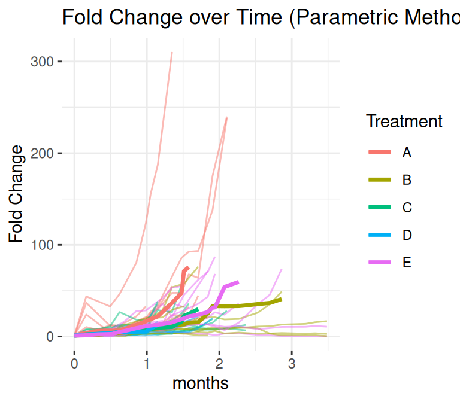
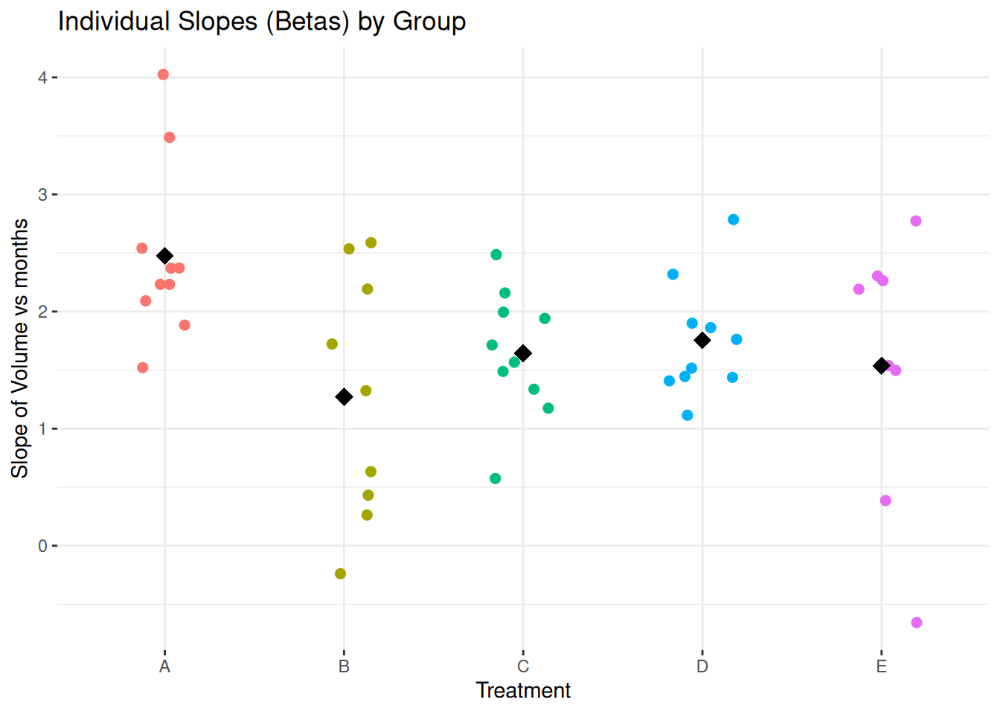

# Getting started with the tumr package

In this guide, we demonstrate the core functionality of the tumr package
using the melanoma2 dataset included with the package. All code required
to reproduce the examples is provided below.

## Loading the Data

``` r

library(tumr)
data("melanoma2")
```

## Creating a tumr Object

Most tumr functions operate on a tumr object, which stores both the data
and its associated metadata (subject ID, time, outcome, and grouping
variable).

To create a tumr object, use the tumr() function:

``` r

melanoma2$months <- melanoma2$Day / (365/12)
mel2 <- tumr(melanoma2, ID, months, Volume, Treatment)
```

Column names can also be supplied as character strings:

``` r

mel2 <- tumr(melanoma2, "ID", "months", "Volume", "Treatment")
```

- This object can now be passed directly to other `tumr` functions.
- Note that the function used to create a `tumr` object includes a
  built-in mechanism to check the scale of the time variable. This is
  because poor scaling of the time variable is a common cause of
  convergence issues when fitting models with
  [`lmm()`](https://pbreheny.github.io/tumr/reference/lmm.md). A simple
  and effective solution is to rescale time to a larger unit (for
  example, from days to months). Users can refer to this
  [article](https://pbreheny.github.io/tumr/articles/articles/troubleshooting.md)
  for more details.

## Visualizing tumor growth under informative dropout

### Existing Naive Mean-Based Visualization is bad

Before introducing tumr functionality, we first construct a simple
plotting function to illustrate a common pitfall in tumor growth
visualization.

##### Code for plot_mean()

Code

``` r

plot_mean <- function(data, group, time, measure, id, stat = median, remove_na = FALSE){
  data_summary <- data |>
    dplyr::group_by({{group}}, {{time}}) |>
    dplyr::summarise(measure = stat({{measure}}, na.rm = remove_na), .groups = "drop_last") |>
    dplyr::ungroup()

  if (remove_na == TRUE) {
    data_full <- data |>
      na.omit(data)
  } else {
    data_full <- data
  }

  ggplot2::ggplot() +
    ggplot2::geom_line(data = data_full,
                       ggplot2::aes(x = {{time}},
                                    y = {{measure}},
                                    group = {{id}},
                                    color = {{group}}),
                       alpha = 0.5)  +
    ggplot2::geom_line(data = data_summary,
                       ggplot2::aes(x = {{time}},
                                    y = measure,
                                    color = {{group}}),
                       linewidth = 1.2) +
    ggplot2::labs(
            y = "Volume",
            title = "Without Accounting for Censoring"
          ) + ggplot2::theme_bw() + ggplot2::theme(panel.border = ggplot2::element_blank())

}
```

**Note:** plot_mean() is not part of the tumr package. It is defined
here solely to provide a baseline visualization for comparison with
tumr’s methods.

### Our plots are good

The figure below compares a naive visualization without accounting for
censoring with a parametric approach that accounts for censoring and
missing observations.

``` r

plot_mean(melanoma2, Treatment, Day, Volume, ID, stat = mean)
plot(mel2, par = TRUE)
```


The plot on the left uses a straightforward summary of observed data at
each time point. This approach ignores the structure of missingness
common in tumor growth studies, where subjects frequently leave the
study due to censoring or dropout. As a result, the apparent decline in
tumor volume over time is an artifact of estimating summaries from a
progressively smaller subset of subjects rather than a true biological
effect. In contrast, the parametric approach shown in the right panel
effectively addresses the issues observed in the left panel.

Also, in the figure below, we present both the parametric method on the
original volume and the fold change (log scale).

``` r

plot(mel2, par = TRUE, fold = FALSE) + ggplot2::scale_y_log10()
```

    Warning in ggplot2::scale_y_log10(): log-10 transformation introduced infinite
    values.

``` r

plot(mel2, par = TRUE, fold = TRUE) + ggplot2::scale_y_log10()
```




Before any summary statistic is computed, the function:

1.  **Aligns time points across subjects** Rows are added for unobserved
    time points so that all subjects share a common time grid.
2.  **Handles trailing missing values due to censoring** The last
    observed value is carried forward and marked with a “+” to indicate
    right-censoring.

- Example: 3, 6, 9, NA → 3, 6, 9, 9+

3.  **Interpolates embedded missing values** Missing observations that
    occur between recorded time points are interpolated to preserve
    trajectory continuity.

After preprocessing, tumor volume summaries are computed at each time
point within each treatment group using a Kaplan–Meier–based approach.
This strategy ensures that summaries reflect both observed data and
informative missingness, producing a visualization that more accurately
represents tumor growth dynamics over time.

## Response feature analysis

One of the primary analysis tools in tumr is the rfeat() function, which
implements response feature analysis. This two-stage approach simplifies
complex longitudinal data by extracting a single interpretable summary
measure per subject.

Specifically, rfeat():

1.  Computes a growth slope (beta coefficient) for each subject

2.  Averages these slopes within each treatment group

3.  Compares group-level summaries using one of the following methods:

    - t-test
    - ANOVA
    - Tukey post-hoc test
    - Both ANOVA and Tukey post-hoc tests

The example below uses comparison = “both” to perform ANOVA followed by
Tukey post-hoc comparisons.

``` r

(rfeat_mel2 <- rfeat(mel2, comparison = "both"))
```

    $anova
                Df Sum Sq Mean Sq F value Pr(>F)
    Group        4  7.794  1.9485   2.938 0.0314 *
    Residuals   42 27.853  0.6632
    ---
    Signif. codes:  0 '***' 0.001 '**' 0.01 '*' 0.05 '.' 0.1 ' ' 1

    $tukey
      Tukey multiple comparisons of means
        95% family-wise confidence level

    Fit: aov(formula = Beta ~ Group, data = betas)

    $Group
              diff        lwr        upr     p adj
    B-A -1.2033657 -2.2696725 -0.1370590 0.0200139
    C-A -0.8320576 -1.8699243  0.2058092 0.1701000
    D-A -0.7204285 -1.7582952  0.3174383 0.2941216
    E-A -0.9384152 -2.0392391  0.1624087 0.1274422
    C-B  0.3713082 -0.6949985  1.4376149 0.8572838
    D-B  0.4829373 -0.5833695  1.5492440 0.6982531
    E-B  0.2649505 -0.8627267  1.3926278 0.9618601
    D-C  0.1116291 -0.9262377  1.1494958 0.9980027
    E-C -0.1063576 -1.2071816  0.9944663 0.9986875
    E-D -0.2179867 -1.3188107  0.8828372 0.9794890

### Plotting Response Feature Results

The plot() method for rfeat objects displays both the individual subject
slopes and the group-level means.

``` r

plot(rfeat_mel2)
```



## Linear mixed-effects modeling

The tumr package also includes lmm(), which fits a linear mixed effects
model to tumor growth data. Linear mixed models are well suited for
longitudinal data because they account for:

- Fixed effects: population-level effects of interest (e.g., treatment,
  time)
- Random effects: subject-specific variability that induces correlation
  among repeated measurements

By default, lmm() fits the model:

`log(measure) ~ group * time + (time | id)`

This specification allows each subject to have their own growth
trajectory while estimating overall treatment effects. The model formula
can be customized if desired.

``` r

lmm_mel2 <- lmm(mel2)
```

    Loading required namespace: optimx

**Note:** You may see a convergence warning when fitting this model. If
this occurs, see the
[Troubleshooting](https://pbreheny.github.io/tumr/articles/articles/troubleshooting.md)
article for guidance.

### Summarizing Linear mixed-effects modeling results

The summary() method for lmm objects uses the emmeans package to report:

- The overall effect of time
- Treatment-specific slopes over time
- Statistical tests comparing slope differences between groups

``` r

summary(lmm_mel2)
```

    $`overall effect of time`
     1       months.trend    SE   df lower.CL upper.CL
     overall         1.68 0.123 41.3     1.43     1.92

    Results are averaged over the levels of: Treatment
    Degrees-of-freedom method: kenward-roger
    Confidence level used: 0.95

    $`slope of treatment over time`
     Treatment months.trend    SE   df lower.CL upper.CL
     A                 2.35 0.268 43.3    1.806     2.89
     B                 1.23 0.270 36.5    0.679     1.77
     C                 1.62 0.263 40.6    1.094     2.16
     D                 1.68 0.288 54.0    1.107     2.26
     E                 1.50 0.283 35.1    0.925     2.07

    Degrees-of-freedom method: kenward-roger
    Confidence level used: 0.95

    $`test slope differences`
     contrast estimate    SE   df t.ratio p.value
     A - B      1.1203 0.380 39.6   2.947  0.0403
     A - C      0.7217 0.375 42.0   1.923  0.3212
     A - D      0.6618 0.393 48.6   1.683  0.4539
     A - E      0.8471 0.390 38.7   2.174  0.2109
     B - C     -0.3987 0.376 38.4  -1.059  0.8261
     B - D     -0.4585 0.395 44.5  -1.162  0.7724
     B - E     -0.2732 0.391 35.7  -0.699  0.9554
     C - D     -0.0599 0.390 47.2  -0.154  0.9999
     C - E      0.1255 0.386 37.5   0.325  0.9975
     D - E      0.1854 0.404 43.2   0.459  0.9905

    Degrees-of-freedom method: kenward-roger
    P value adjustment: tukey method for comparing a family of 5 estimates 

### Plotting Linear mixed-effects modeling results

Finally, tumr provides a plot() method for lmm objects that produces two
visualizations:

1.  Predicted tumor growth trajectories over time (log scale)
2.  Estimated mean growth slopes for each group with confidence
    intervals

``` r

plot(lmm_mel2, "response") 
```

    Model has log transformed response. Predictions are on transformed
      scale.


``` r

plot(lmm_mel2, "slope")
```


### Checking for exponential growth

Since lmm() model the data on log scale by default and a straight line
corresponds to exponential growth on log scale, we can check whether the
exponential growth model fits well by plotting the residuals from Linear
Mixed Model vs time.

``` r

check_exp(lmm_mel2)
```

    `geom_smooth()` using formula = 'y ~ x'


## Flexible modeling of nonlinear growth

For datasets that exhibit non-linear growth, we also provide the
[Exponential quadratic
model](https://pbreheny.github.io/tumr/articles/articles/quadratic.md)
and [Generalized Addictive Model
(GAM)](https://pbreheny.github.io/tumr/articles/articles/gam.md) as
alternative modeling approaches. Examples of their applications can be
found in the linked articles.

## Tumor Doubling Time Based on lmm()

``` r

dtime(lmm_mel2)
```

    $method
    [1] "Tumor Doubling Time Based on Linear Mixed Model"

    $message
    [1] "The model should demonstrate an exponential growth pattern."

    $summary
      Treatment mean median q2.5 q97.5
    1         A 0.30   0.30 0.24  0.38
    2         B 0.60   0.57 0.39  0.97
    3         C 0.44   0.42 0.32  0.63
    4         D 0.42   0.41 0.31  0.60
    5         E 0.48   0.46 0.34  0.73

## Bayesian hierarchical linear model

In addition to the linear mixed-effects modeling, our package also
supports fitting a Bayesian hierarchical linear model. Detailed usage of
this model is described in an
[article](https://pbreheny.github.io/tumr/articles/articles/bhm.md).
