# Getting started with the tumr package

In this guide, we demonstrate the core functionality of the tumr package
using the melanoma2 dataset included with the package. All code required
to reproduce the examples is provided below.

## Loading the Data

``` r

library(tumr)
data("melanoma2")
```

## Creating a tumr Object

Most tumr functions operate on a tumr object, which stores both the data
and its associated metadata (subject ID, time, outcome, and grouping
variable).

To create a tumr object, use the tumr() function:

``` r

melanoma2$months <- melanoma2$Day / (365/12)
mel2 <- tumr(melanoma2, ID, months, Volume, Treatment)
```

This object can now be passed directly to other `tumr` functions. Note
that the function used to create a `tumr` object includes a built-in
mechanism to check the scale of the time variable. This is because poor
scaling of the time variable is a common cause of convergence issues
when fitting models with
[`lmm()`](https://pbreheny.github.io/tumr/reference/lmm.md). A simple
and effective solution is to rescale time to a larger unit (for example,
from days to months). Users can refer to this
[article](https://pbreheny.github.io/tumr/articles/articles/troubleshooting.md)
for more details.

## Visualizing tumor growth under informative dropout

### Existing Naive Mean-Based Visualization is bad

Before introducing tumr functionality, we first construct a simple
plotting function to illustrate a common pitfall in tumor growth
visualization.

##### Code for plot_mean()

Code

``` r

plot_mean <- function(data, group, time, measure, id, stat = median, remove_na = FALSE){
  data_summary <- data |>
    dplyr::group_by({{group}}, {{time}}) |>
    dplyr::summarise(measure = stat({{measure}}, na.rm = remove_na), .groups = "drop_last") |>
    dplyr::ungroup()

  if (remove_na == TRUE) {
    data_full <- data |>
      na.omit(data)
  } else {
    data_full <- data
  }

  ggplot2::ggplot() +
    ggplot2::geom_line(data = data_full,
                       ggplot2::aes(x = {{time}},
                                    y = {{measure}},
                                    group = {{id}},
                                    color = {{group}}),
                       alpha = 0.5)  +
    ggplot2::geom_line(data = data_summary,
                       ggplot2::aes(x = {{time}},
                                    y = measure,
                                    color = {{group}}),
                       linewidth = 1.2) +
    ggplot2::labs(
            y = "Volume",
            title = "Volume over Time"
          ) + ggplot2::theme_bw() + ggplot2::theme(panel.border = ggplot2::element_blank())

}
```

**Note:** plot_mean() is not part of the tumr package. It is defined
here solely to provide a baseline visualization for comparison with
tumr’s methods.

### Our plots are good

The figure below compares a naive longitudinal visualization with a
tumr-based approach that explicitly accounts for censoring and missing
observations.

``` r

plot_mean(melanoma2, Treatment, Day, Volume, ID, stat = mean)
plot(mel2, par = FALSE)
```

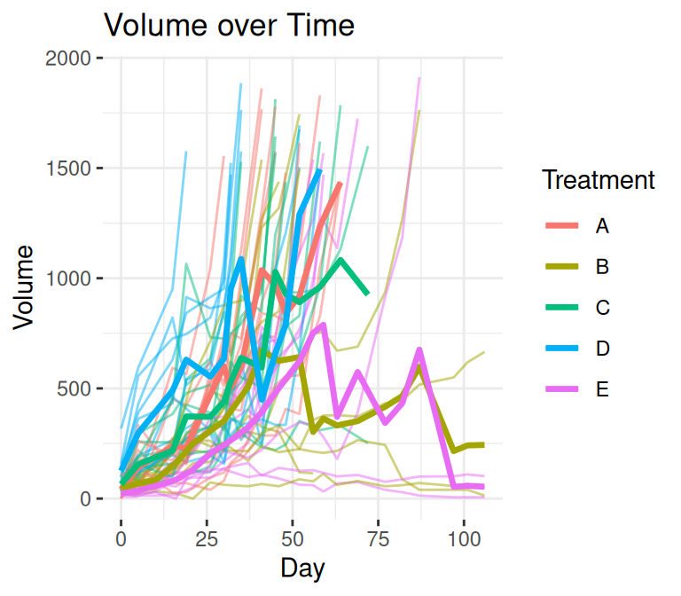

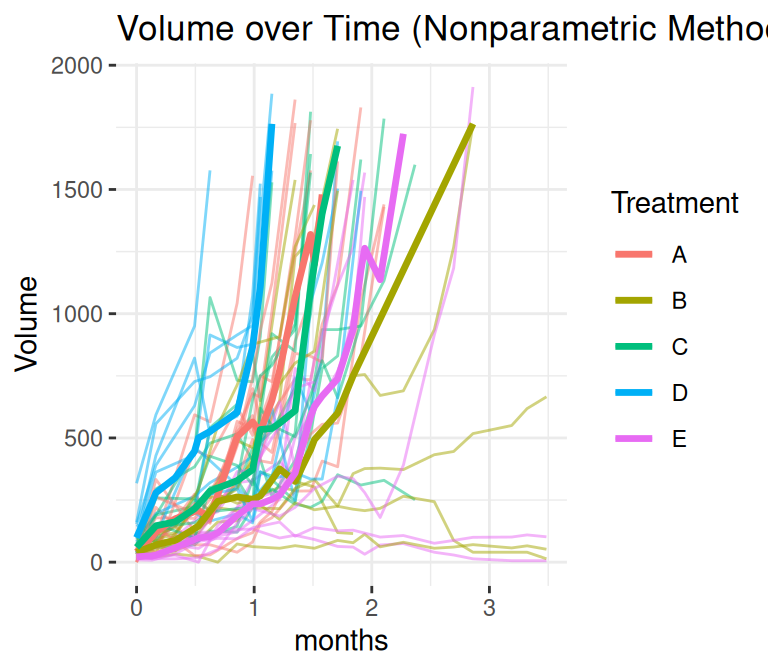

The plot on the left uses a straightforward summary of observed data at
each time point. This approach ignores the structure of missingness
common in tumor growth studies, where subjects frequently leave the
study due to censoring or dropout. As a result, the apparent decline in
tumor volume over time is an artifact of estimating summaries from a
progressively smaller subset of subjects rather than a true biological
effect.

Also, parametric methods can be used for visualization.

``` r

plot(mel2, par = TRUE)
plot(mel2, par = TRUE, fold = TRUE)
```

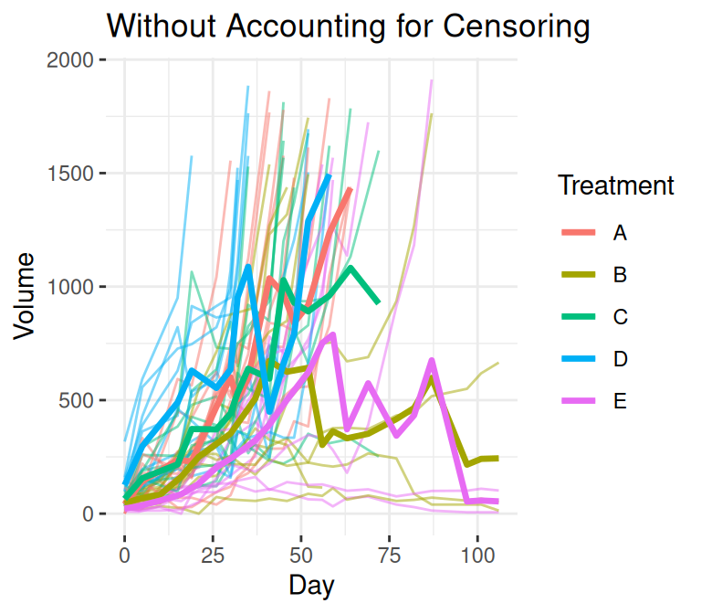

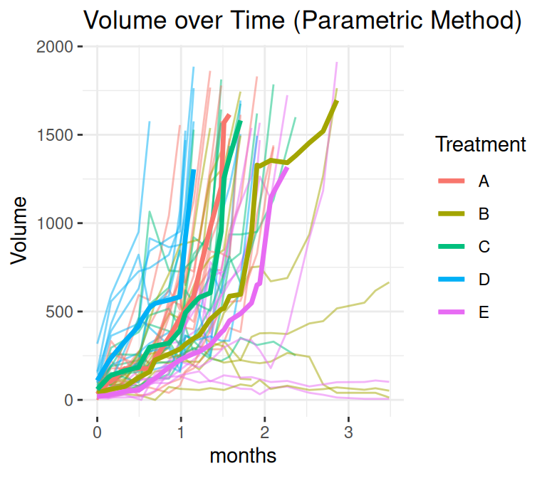

The visualization produced by plot_median() addresses these issues
through an explicit preprocessing step designed for longitudinal tumor
data.

Before any summary statistic is computed, the function:

1.  **Aligns time points across subjects** Rows are added for unobserved
    time points so that all subjects share a common time grid.
2.  **Handles trailing missing values due to censoring** The last
    observed value is carried forward and marked with a “+” to indicate
    right-censoring.

- Example: 3, 6, 9, NA → 3, 6, 9, 9+

3.  **Interpolates embedded missing values** Missing observations that
    occur between recorded time points are interpolated to preserve
    trajectory continuity.

After preprocessing, tumor volume summaries are computed at each time
point within each treatment group using a Kaplan–Meier–based approach.
This strategy ensures that summaries reflect both observed data and
informative missingness, producing a visualization that more accurately
represents tumor growth dynamics over time.

## Response feature analysis

One of the primary analysis tools in tumr is the rfeat() function, which
implements response feature analysis. This two-stage approach simplifies
complex longitudinal data by extracting a single interpretable summary
measure per subject.

Specifically, rfeat():

1.  Computes a growth slope (beta coefficient) for each subject

2.  Averages these slopes within each treatment group

3.  Compares group-level summaries using one of the following methods:

    - t-test
    - ANOVA
    - Tukey post-hoc test
    - Both ANOVA and Tukey post-hoc tests

The example below uses comparison = “both” to perform ANOVA followed by
Tukey post-hoc comparisons.

``` r

(rfeat_mel2 <- rfeat(mel2, comparison = "both"))
```

    $anova
                Df Sum Sq Mean Sq F value Pr(>F)
    Group        4  7.794  1.9485   2.938 0.0314 *
    Residuals   42 27.853  0.6632
    ---
    Signif. codes:  0 '***' 0.001 '**' 0.01 '*' 0.05 '.' 0.1 ' ' 1

    $tukey
      Tukey multiple comparisons of means
        95% family-wise confidence level

    Fit: aov(formula = Beta ~ Group, data = betas)

    $Group
              diff        lwr        upr     p adj
    B-A -1.2033657 -2.2696725 -0.1370590 0.0200139
    C-A -0.8320576 -1.8699243  0.2058092 0.1701000
    D-A -0.7204285 -1.7582952  0.3174383 0.2941216
    E-A -0.9384152 -2.0392391  0.1624087 0.1274422
    C-B  0.3713082 -0.6949985  1.4376149 0.8572838
    D-B  0.4829373 -0.5833695  1.5492440 0.6982531
    E-B  0.2649505 -0.8627267  1.3926278 0.9618601
    D-C  0.1116291 -0.9262377  1.1494958 0.9980027
    E-C -0.1063576 -1.2071816  0.9944663 0.9986875
    E-D -0.2179867 -1.3188107  0.8828372 0.9794890

### Plotting Response Feature Results

The plot() method for rfeat objects displays both the individual subject
slopes and the group-level means.

``` r

plot(rfeat_mel2)
```

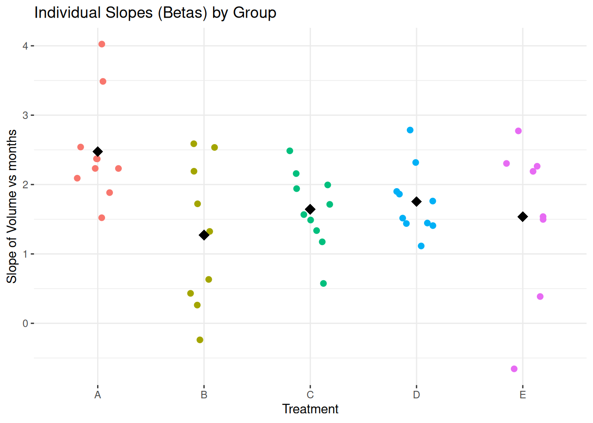

## Linear mixed model

The tumr package also includes lmm(), which fits a linear mixed effects
model to tumor growth data. Linear mixed models are well suited for
longitudinal data because they account for:

- Fixed effects: population-level effects of interest (e.g., treatment,
  time)
- Random effects: subject-specific variability that induces correlation
  among repeated measurements

By default, lmm() fits the model:

`log1p(measure) ~ group * time + (time | id)`

This specification allows each subject to have their own growth
trajectory while estimating overall treatment effects. The model formula
can be customized if desired.

``` r

(lmm_mel2 <- lmm(mel2))
```

    Linear mixed model fit by REML. t-tests use Satterthwaite's method [
    lmerModLmerTest]
    Formula: log1p(Volume) ~ Treatment * months + (months | ID)
       Data: data

    REML criterion at convergence: 1182.4

    Scaled residuals:
        Min      1Q  Median      3Q     Max
    -6.8683 -0.3590  0.0569  0.4891  4.0759

    Random effects:
     Groups   Name        Variance Std.Dev. Corr
     ID       (Intercept) 0.3911   0.6254
              months      0.6025   0.7762   -0.51
     Residual             0.3221   0.5675
    Number of obs: 568, groups:  ID, 47

    Fixed effects:
                      Estimate Std. Error      df t value Pr(>|t|)
    (Intercept)         3.6609     0.2269 46.8170  16.134  < 2e-16 ***
    TreatmentB          0.5383     0.3226 42.8852   1.669  0.10244
    TreatmentC          0.7805     0.3196 46.0697   2.442  0.01849 *
    TreatmentD          1.3329     0.3241 48.7024   4.112  0.00015 ***
    TreatmentE         -0.1469     0.3320 42.4100  -0.443  0.66031
    months              2.4245     0.2729 47.8797   8.885 1.07e-11 ***
    TreatmentB:months  -1.2083     0.3860 43.3477  -3.130  0.00312 **
    TreatmentC:months  -0.8130     0.3818 46.2297  -2.129  0.03861 *
    TreatmentD:months  -0.7594     0.4018 54.1899  -1.890  0.06412 .
    TreatmentE:months  -0.9309     0.3953 42.1808  -2.355  0.02327 *
    ---
    Signif. codes:  0 '***' 0.001 '**' 0.01 '*' 0.05 '.' 0.1 ' ' 1

    Correlation of Fixed Effects:
                (Intr) TrtmnB TrtmnC TrtmnD TrtmnE months TrtmB: TrtmC: TrtmD:
    TreatmentB  -0.703
    TreatmentC  -0.710  0.499
    TreatmentD  -0.700  0.492  0.497
    TreatmentE  -0.683  0.481  0.485  0.478
    months      -0.577  0.406  0.410  0.404  0.395
    TrtmntB:mnt  0.408 -0.560 -0.290 -0.286 -0.279 -0.707
    TrtmntC:mnt  0.413 -0.290 -0.573 -0.289 -0.282 -0.715  0.505
    TrtmntD:mnt  0.392 -0.276 -0.278 -0.586 -0.268 -0.679  0.480  0.485
    TrtmntE:mnt  0.398 -0.280 -0.283 -0.279 -0.556 -0.690  0.488  0.493  0.469

**Note:** You may see a convergence warning when fitting this model. If
this occurs, see the
[Troubleshooting](https://pbreheny.github.io/tumr/articles/articles/troubleshooting.md)
article for guidance.

### Summarizing Linear Mixed Model Results

The summary() method for lmm objects uses the emmeans package to report:

- The overall effect of time
- Treatment-specific slopes over time
- Statistical tests comparing slope differences between groups

``` r

summary(lmm_mel2)
```

    $`overall effect of time`
     1       months.trend    SE   df lower.CL upper.CL
     overall         1.68 0.125 41.3     1.43     1.93

    Results are averaged over the levels of: Treatment
    Degrees-of-freedom method: kenward-roger
    Confidence level used: 0.95

    $`slope of treatment over time`
     Treatment months.trend    SE   df lower.CL upper.CL
     A                 2.42 0.273 43.6    1.874     2.98
     B                 1.22 0.273 35.8    0.662     1.77
     C                 1.61 0.267 40.6    1.072     2.15
     D                 1.67 0.296 55.4    1.073     2.26
     E                 1.49 0.286 34.4    0.912     2.07

    Degrees-of-freedom method: kenward-roger
    Confidence level used: 0.95

    $`test slope differences`
     contrast estimate    SE   df t.ratio p.value
     A - B      1.2083 0.386 39.4   3.128  0.0259
     A - C      0.8130 0.382 42.1   2.128  0.2278
     A - D      0.7594 0.402 49.4   1.887  0.3378
     A - E      0.9309 0.396 38.4   2.353  0.1505
     B - C     -0.3953 0.382 38.0  -1.034  0.8378
     B - D     -0.4489 0.403 44.8  -1.115  0.7978
     B - E     -0.2774 0.396 35.0  -0.701  0.9549
     C - D     -0.0536 0.399 47.9  -0.134  0.9999
     C - E      0.1179 0.392 37.0   0.301  0.9981
     D - E      0.1715 0.411 43.4   0.417  0.9935

    Degrees-of-freedom method: kenward-roger
    P value adjustment: tukey method for comparing a family of 5 estimates 

### Plotting Linear Mixed Model Results

Finally, tumr provides a plot() method for lmm objects that produces two
visualizations:

1.  Predicted tumor growth trajectories over time
2.  Estimated mean growth slopes for each group with confidence
    intervals

``` r

plot(lmm_mel2, "response")
```

    Model has log1p-transformed response. Back-transforming predictions to
      original response scale. Standard errors are still on the transformed
      scale.

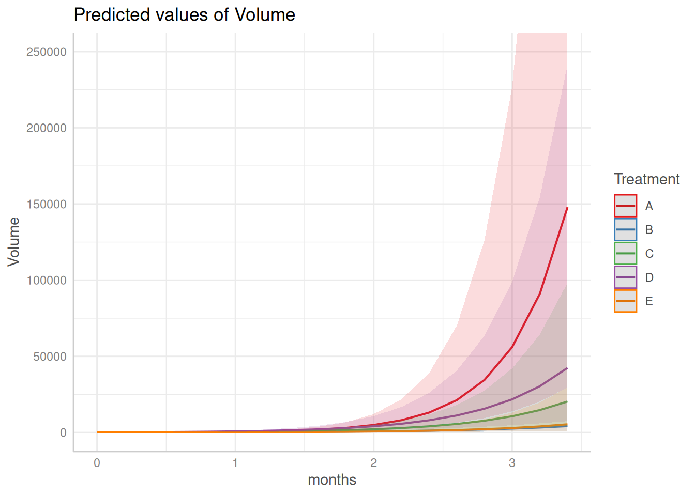

``` r

plot(lmm_mel2, "response") + ggplot2::scale_y_log10()
```

    Model has log1p-transformed response. Back-transforming predictions to
      original response scale. Standard errors are still on the transformed
      scale.

    Scale for y is already present.
    Adding another scale for y, which will replace the existing scale.

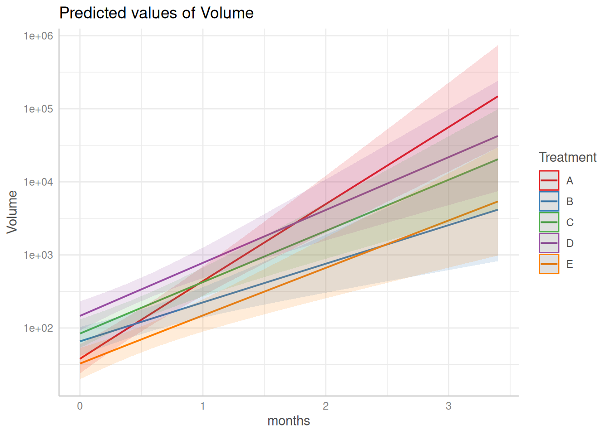

``` r

plot(lmm_mel2, "slope")
```

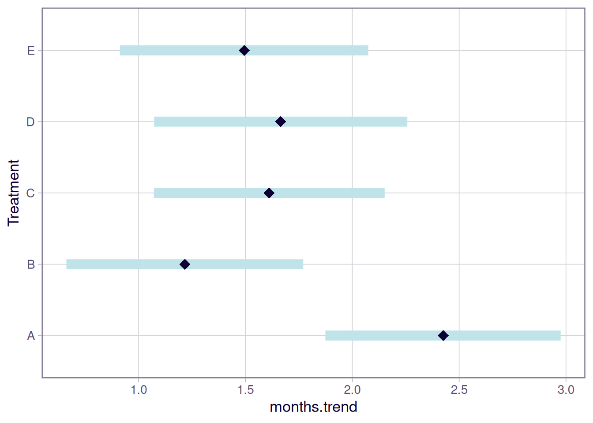

### Checking for exponential growth

Since lmm() model the data on log scale by default and a straight line
corresponds to exponential growth on log scale, we can check whether the
exponential growth model fits well by plotting the residuals from Linear
Mixed Model vs time.

``` r

plot(mel2, par = TRUE) + ggplot2::scale_y_log10()
```

    Warning in ggplot2::scale_y_log10(): log-10 transformation introduced infinite
    values.

``` r

plot(mel2, par = TRUE, fold = TRUE) + ggplot2::scale_y_log10()
```

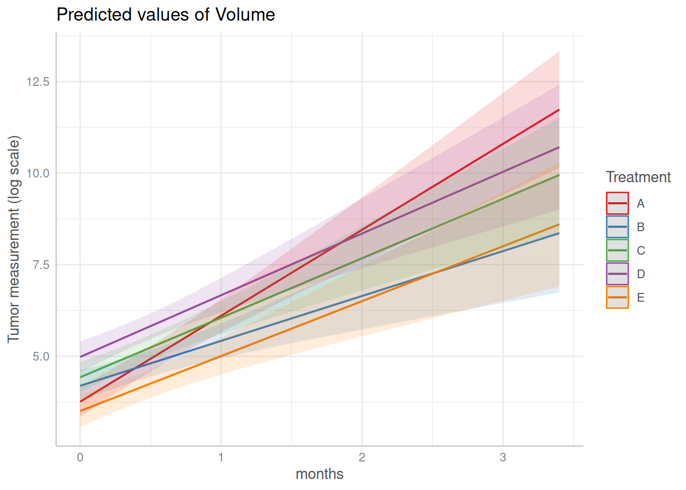

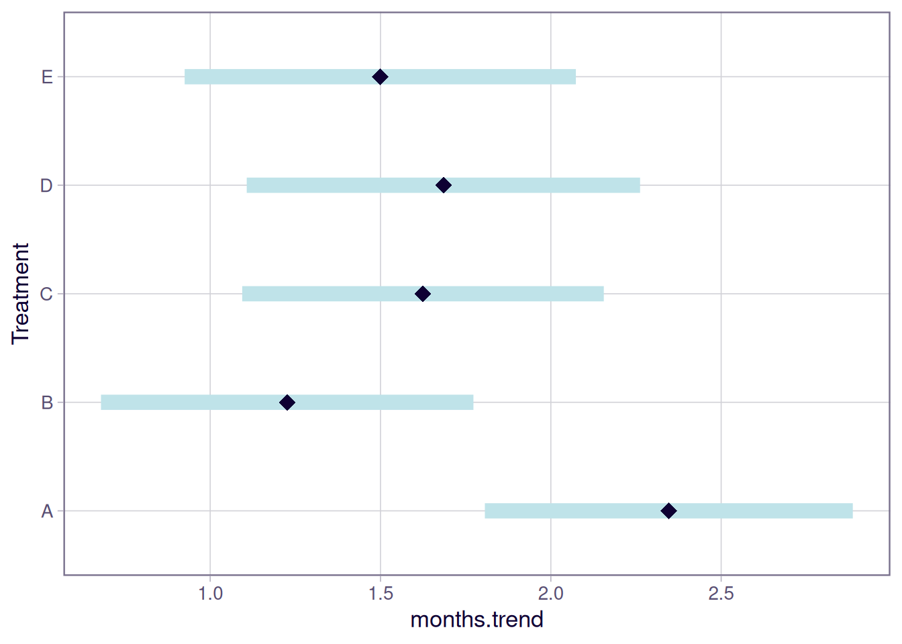

``` r

check_exp(lmm_mel2)
```

    `geom_smooth()` using formula = 'y ~ x'

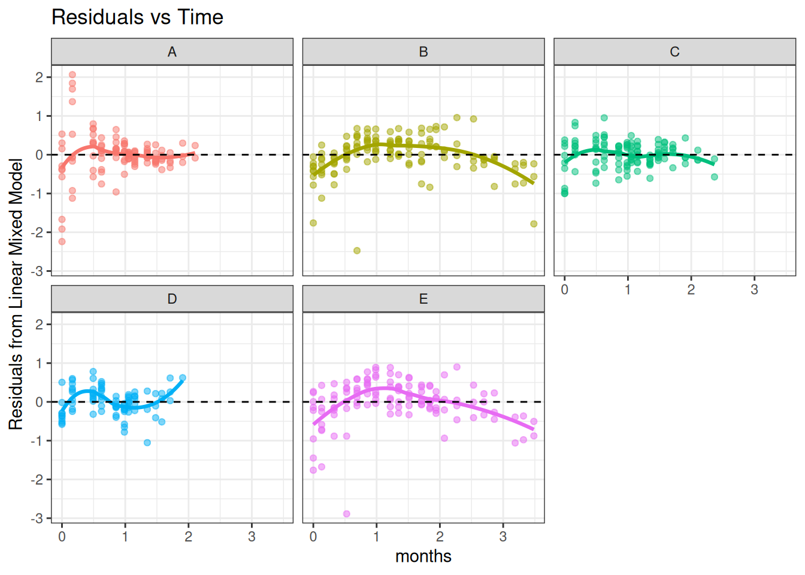

### Tumor Doubling Time Based on Fitted Tumor Growth Model

For tumors following approximately exponential growth, the doubling time
is

T_d=\frac{\log(2)}{\beta},

where (\>0) is the estimated growth rate. For an lmm object, dtime()
computes the treatment-specific slope from the fixed time effect and
treatment-by-time interactions. Uncertainty is assessed using 1,000
parametric bootstrap samples, and the resulting doubling times are
summarized by their mean, median, and 95% interval. Non-positive slopes
are assigned an infinite doubling time.

``` r

dtime(lmm_mel2)
```

    $method
    [1] "Tumor Doubling Time Based on Linear Mixed Model"

    $message
    [1] "The model should demonstrate an exponential growth pattern."

    $summary
      Treatment mean median q2.5 q97.5
    1         A 0.29   0.29 0.23  0.37
    2         B 0.60   0.57 0.39  1.00
    3         C 0.44   0.43 0.32  0.64
    4         D 0.43   0.41 0.31  0.62
    5         E 0.49   0.47 0.34  0.73

dtime() can also be applied to a bhm object, using posterior draws of
the treatment-specific slopes. Details about how to use dtime() for bhm
project can be found in [Bayesian hierarchical linear
model](https://pbreheny.github.io/tumr/articles/articles/bhm.md).

## Flexible modeling of nonlinear growth

For datasets that exhibit non-linear growth, we also provide the
[Exponential Quadratic
Model](https://pbreheny.github.io/tumr/articles/articles/quadratic.md)
and [Generalized Addictive Mixed
Model](https://pbreheny.github.io/tumr/articles/articles/gam.md) as
alternative modeling approaches. Examples of their applications can be
found in the linked articles.

## Bayesian Hierarchical Linear Model

In addition to the linear mixed model, the package also supports fitting
a [Bayesian hierarchical linear
model](https://pbreheny.github.io/tumr/articles/articles/bhm.md).
Detailed usage of this model is described in an article.
